# Ember Developer Guide

# 1. CI/CD

## 1.1 Build and Publish Pipeline

Primary script:

- `scripts/build-and-push.sh`

**What It Publishes**

Image matrix in the script:

- `gateway`
- `user-service`
- `class-service`
- `quiz-service`
- `ai-service`
- `game-service`
- `web-app`
- `phone-frame`
- `phone-web-app`

Each image is pushed with:

- A version tag (for example `v42`)
- `latest`

**Tag Strategy**

Tag resolution logic:

1. If `--tag` is provided, use it directly.
2. Else read `IMAGE_TAG` from env file.
3. If format is `v<number>`, increment number.
4. If format is `<number>`, increment number.
5. Fallback default is `v1`.

After publishing, the script writes:

- Updated `IMAGE_TAG`
- Each `*_IMAGE` env value pointing to the newly published version tag

This means `.env.prod` evolves with each publish.

**Push Authentication and WSL Fallback**

The script has built-in handling for Docker credential edge cases (notably WSL/desktop credential helper mismatch):

- It detects `credsStore=desktop.exe` scenarios.
- It creates a temporary Docker config for push if needed.
- It logs in using extracted credentials and pushes with that temp config.

**Multi-Platform and Build Args**

If `DOCKER_PLATFORM` is set, script switches to `docker buildx build --push`.

It also injects phone web app API endpoints as build args:

- `EXPO_PUBLIC_USER_SVC_URL`
- `EXPO_PUBLIC_QUIZ_SVC_URL`
- `EXPO_PUBLIC_CLASS_SVC_URL`
- `EXPO_PUBLIC_GAME_SVC_URL`

**Useful Commands**

```bash
# Publish everything using next auto tag
./scripts/build-and-push.sh

# Publish selected services only
./scripts/build-and-push.sh --service class-service,quiz-service

# Publish with explicit tag
./scripts/build-and-push.sh --tag v99

# Override env source file
ENV_FILE=.env.prod ./scripts/build-and-push.sh
```

## 1.2 Development Docker Compose

File:

- `docker-compose.dev.yml`

Purpose: local development with source binded mounts (including dependencies like node_modules).

**Core Infrastructure Services**

- Redis (`redis:7-alpine`) with password and AOF.
- Redpanda broker + Console (`:8080`).
- Nginx dev proxy (`:8085`).
- One MongoDB per service domain:
  - `mongo-user` (`:27018`)
  - `mongo-quiz` (`:27019`)
  - `mongo-class` (`:27017`)
  - `mongo-ai` (`:27020`)
  - `mongo-game` (`:27021`)
- Replica set bootstrap jobs for each Mongo instance (Needed for Mongo transactions to work). Dont need to pay much attention to these containers. They run an `rs.initiate()` command and exit after. Every time you start the dev compose, you will see these briefly spin up and then exit with code 0. This is expected behaviour.
  - `mongo-init-user`, `mongo-init-quiz`, `mongo-init-class`, `mongo-init-ai`, `mongo-init-game`

**Service Startup Pattern in Development**

- API containers use `npm run dev` with bind mounts.
- Worker responsibilities are still separate in code (`worker.ts`) and must be run as needed.
- `dev-proxy` routes client and API calls through the same gateway container for simplified CORS. This prevents potential problematic environment variables in clients as internal docker urls cannot be accessed from outside of the compose network, while external urls cannot be accessed from inside the compose network.

## 1.3 Test/Deployment Compose (Used for Hosted User Testing)

File:

- `docker-compose.test.yml`

Used for user testing. It is much closer to a production envrionment with pre-built images and more realistic runtime configurations. It does not support hot reloads like the dev stack, and it pulls images from Docker Hub that is populated by the `build-and-push.sh` script.

**Differences from Development Stack**

- Uses prebuilt images from Docker Hub.
- Uses persistent host storage (`HOST_DATA_ROOT`).
- Contains seperate worker containers for services that have background processing. In the dev stack, these workers are run in parallel in the same container as the API.
  - `class-worker`
  - `quiz-worker`
  - `game-worker`
- Uses a seperate Nginx proxy configuration (`nginx-test.conf`) for routing API and client calls.

---

# 2. Infrastructure Layer

## 2.1 Kafka/Redpanda Setup and Topic Model

Kafka clients are set up in:

- `services/quiz-service/src/events/utils/kafka.ts`
- `services/class-service/src/utils/events/kafka.ts`
- `services/game-service/src/events/kafka.ts`

Topic names are defined in each service's `types.ts` and can be overridden by env vars.

For test compose stack, topic names can be configured in the environment variables:

- `TOPIC_QUIZ_ATTEMPT`
- `TOPIC_QUIZ_LIFECYCLE`
- `TOPIC_SCHEDULE_LIFECYCLE`
- `TOPIC_CLASS_LIFECYCLE`
- `TOPIC_CLASS_CANONICAL`

**Topics and Intent**

| Topic                | Main Producer | Main Consumers            | Purpose                                                       |
| -------------------- | ------------- | ------------------------- | ------------------------------------------------------------- |
| `quiz.attempt.v1`    | Quiz Service  | Class Worker, Game Worker | Attempt finalization/invalidation stream                      |
| `quiz.lifecycle.v1`  | Quiz Service  | Class Worker              | Quiz delete/meta/version lifecycle sync                       |
| `class.schedule.v1`  | Class Service | Quiz Worker               | Schedule lifecycle updates affecting eligibility/invalidation |
| `class.lifecycle.v1` | Class Service | Game Worker               | Class/student/schedule lifecycle projection                   |
| `class.canonical.v1` | Class Service | Game Worker               | Canonical score reconciliation stream                         |

**Producer Headers and Schema Hints**

Publishers include event headers:

- `content-type=application/json`
- `schema-version`
- `event-type`
- `event-id`

These are set in `publish(...)` helpers in Kafka modules.

## 2.2 Outbox Pattern and Reliability

Outbox implementations:

- Quiz:
  - `services/quiz-service/src/model/outbox-model.ts`
  - `services/quiz-service/src/events/outgoing/outbox-enqueue.ts`
  - `services/quiz-service/src/events/outgoing/outbox-publisher.ts`
- Class:
  - `services/class-service/src/model/events/outbox-model.ts`
  - `services/class-service/src/utils/events/outbox-enqeue.ts`
  - `services/class-service/src/utils/events/outbox-publisher.ts`

**Behavioural Guarantees**

1. Event row persisted into mongodb before pushing to Kafka.
2. Event ID is row `_id` for enqueue idempotency.
3. Publisher indicates pending rows (`pending -> publishing`).
4. Rows that become stale are requeued.
5. Success marked as `published`.

The outbox is important for ensuring reliability. Without outbox, a service can commit DB state and crash before publishing to Kafka, leading to silent inconsistencies between services.

## 2.3 Consumer Idempotency and Dedupe Tables

Inbound dedupe models:

- Class:
  - `services/class-service/src/model/events/inbound-quiz-event-model.ts`
- Game:
  - `services/game-service/src/model/events/inbound-quiz-event-model.ts`
  - `services/game-service/src/model/events/inbound-class-event-model.ts`
  - `services/game-service/src/model/events/inbound-canonical-event-model.ts`

These models key by `eventId` and prevent duplicate event application.

## 2.4 Redis Usage for Attempt Deadlines

Redis integration:

- `services/quiz-service/src/events/utils/redis.ts`
- `services/quiz-service/src/events/internal/attempt-expiry.ts`

Deadline mechanism:

- ZSET key: `attempt:deadlines`
- Score: unix epoch seconds
- Value: `attemptId`

Worker loop:

1. Read due IDs.
2. Remove them optimistically from ZSET.
3. Auto-grade and finalize if still `in_progress`.
4. Emit `AttemptFinalized` event via outbox path.

Timer computation combines:

- Intrinsic quiz duration (`totalTimeLimit`, or rapid per-item time sum)
- Schedule end time
- Hard safety cap and grace buffer

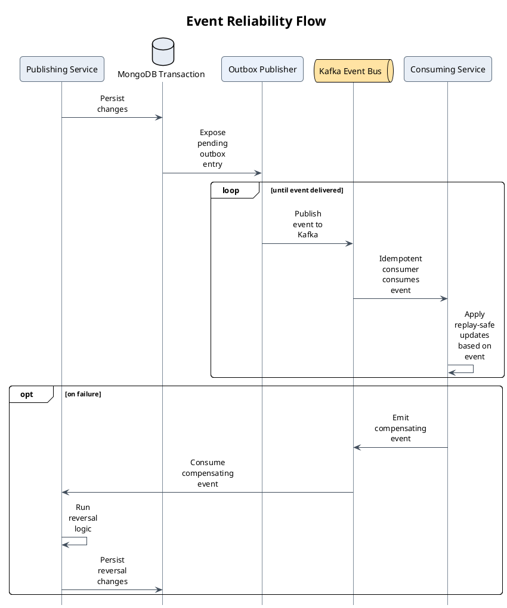
```plantuml
@startuml
title Event Reliability Flow
!theme plain
skinparam backgroundColor #FFFFFF
skinparam defaultFontName Cabin
skinparam shadowing false
skinparam roundCorner 10
skinparam sequenceMessageAlign center
skinparam ArrowColor #3F4C5A
skinparam SequenceLifeLineBorderColor #7D8B99
skinparam SequenceLifeLineBackgroundColor #F6F8FB
skinparam ParticipantBorderColor #5D6D7E
skinparam ParticipantBackgroundColor #EAF1FB
skinparam wrapWidth 120
skinparam maxMessageSize 70
skinparam ParticipantPadding 8
skinparam BoxPadding 6
skinparam Padding 4
skinparam ResponseMessageBelowArrow true
hide footbox

participant "Publishing Service" as Pub #E8EEF6
database "MongoDB Transaction" as Store #E6ECF4
participant "Outbox Publisher" as Outbox #EAF1FB
queue "Kafka Event Bus" as Kafka #FFE3A3
participant "Consuming Service" as Cons #E8EEF6

Pub -> Store: Persist changes
Store -> Outbox: Expose pending outbox entry

loop until event delivered
  Outbox -> Kafka: Publish event to Kafka
  Kafka -> Cons: Idempotent consumer consumes event
  Cons -> Cons: Apply replay-safe updates based on event
end

opt on failure
  Cons -> Kafka: Emit compensating event
  Kafka -> Pub: Consume compensating event
  Pub -> Pub: Run reversal logic
  Pub -> Store: Persist reversal changes
end
@enduml
```

## 2.5 Communication Model (Synchronous vs Asynchronous)

This system uses both communication modes depending on the use case:

Synchronous HTTP is used when the caller needs an immediate response or a failure/success acknowledgement:

- Clients -> service API calls (e.g. signing in, quiz authoring, starting an attempt)
- Service-to-service (S2S) eligibility/authorization checks (e.g. Quiz -> Class helper checks for attempt eligibility)

Asynchronous, event based communication is used where immediacy is not required, and where decoupling has high benefits for modularisation and reliability:

- Attempt and quiz lifecycle propagation (e.g. when a quiz is updated or deleted, or when an attempt is finalized or invalidated)
- Schedule lifecycle propagation (e.g. when a schedule is updated or deleted)
- Class lifecycle propagation (e.g. when a class or student is updated or deleted)

## 2.6 Deployment and Runtime Topology

There are three main layers in the deployment topology:

1. Ingress and routing

- Nginx gateway/proxy routes requests to the correct containers.

2. Stateless API processes

- Each service API process serves HTTP and persists state to its own domain database only.
- No service writes directly to another service database.

3. Background workers

- Worker processes handle outbox publishing, event consumption, and long-running background jobs.
- Worker isolation prevents API responsiveness from being degraded by event backlog or batch tasks.

This model allows for scalability, while balancing operational complexity:

- API containers can scale for request load.
- Workers can scale independently for event throughput.
- Temporary worker lag causes projection delay, not API failures.

---

# 3. Services

## 3.1 User Service

### 3.1.1 Service Scope

User Service handles authentication and access control for teachers and students. It deals with:

- Teacher authentication flows
- Student authentication flows
- Account verification and password lifecycle
- Teacher profile/account operations

It is queried by other services for token verification (`/auth/me`) in ownership and role restricted operations.

### 3.1.2 Runtime Entrypoints

- HTTP bootstrap:
  - `services/user-service/src/server.ts`
- Express app mount:
  - `services/user-service/src/index.ts`

Route grouping:

- `auth-routes.ts`
  - Shared/public auth entry points used during account bootstrap (for example initial sign-up and verification-related flows).
- `teacher-auth-routes.ts`
  - Teacher identity lifecycle: sign-in, password reset, token-based auth state transitions.
- `teacher-user-routes.ts`
  - Teacher profile and account management operations once authenticated.
- `student-auth-routes.ts`
  - Student sign-in/session issuance paths used by the mobile app.
- `student-user-routes.ts`
  - Student profile/account reads and updates under authenticated context.

Controller grouping:

- `teacher-auth-controller.ts`
  - Core teacher credential lifecycle and verification/reset logic.
- `teacher-user-controller.ts`
  - Teacher profile mutations and user-facing account metadata operations.
- `student-auth-controller.ts`
  - Student authentication and token issuance paths.
- `student-user-controller.ts`
  - Student profile reads/writes.
- `controller/helpers/*`
  - Shared helper routines for email confirmation, resend, and profile update logic to avoid controller duplication.

### 3.1.3 Data Model Layer

Core models:

- `teacher-user-model.ts`
  - Persistent teacher identity state, including verification/disable flags and teacher-facing account profile fields.
- `teacher-auth-token-model.ts`
  - Temporary auth artefacts (verification and reset token records) with TTL-backed expiry semantics.
- `student-user-model.ts`
  - Teacher-provisioned student identities used by mobile login and class-linked ownership checks.

Model behaviours:

- `teacher-auth-token-model.ts` stores purpose-specific token rows (`email_verify`, `password_reset`, `email_change`) with expiry + `usedAt` lifecycle.
- Token verification paths always validate both token state and linked user state before mutating any credential/email data.
- Student and teacher account disable/must-change-password flags are enforced in middleware, not only in login handlers.

### 3.1.4 Access Control

Middleware:

- `services/user-service/src/middleware/access-control.ts`

Important behaviour:

- JWT verification is done against `JWT_SECRET`, configurable via env variables.
- `req.user` is normalized as role + identity + privilege fields.
- Access control is implemented as middleware functions that can be composed for each route as needed.
  - `verifyAccessToken`
  - `verifyTeacherAccessToken`
  - `verifyStudentAccessToken`
  - `verifyIsAdmin`
  - `verifyIsOwnerOrAdmin`

### 3.1.5 Key Workflows

**Teacher sign-up -> email verification -> activation**

Relevant implementation:

- `services/user-service/src/routes/auth-routes.ts`
- `services/user-service/src/controller/teacher-auth-controller.ts`
  - Main orchestration of temporary account creation, token issuing, and token verification.
- `services/user-service/src/model/teacher-user-model.ts`
- `services/user-service/src/model/teacher-auth-token-model.ts`
  - Token persistence, verification and consumption logic.
- `services/user-service/src/utils/otp.ts`
  - OTP/token generation and comparison helpers.
- `services/user-service/src/utils/mail.ts`
  - Verification email delivery logic.

Flow detail:

1. Teacher submits sign-up request.
2. Service creates a temporary teacher account record.
3. Verification OTP/token is generated and stored.
4. Verification email is sent.
5. Teacher confirms OTP.
6. Account is marked verified and promoted into normal login lifecycle.

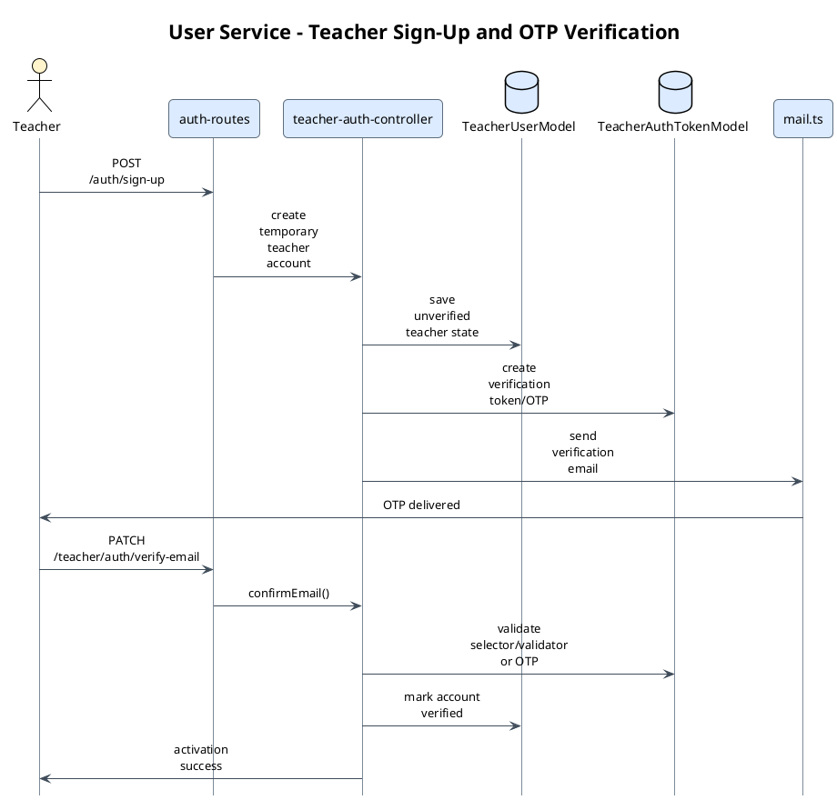
```plantuml
@startuml
title User Service - Teacher Sign-Up and OTP Verification
!theme plain
skinparam backgroundColor #FFFFFF
skinparam defaultFontName Cabin
skinparam shadowing false
skinparam roundCorner 10
skinparam sequenceMessageAlign center
skinparam ArrowColor #3F4C5A
skinparam SequenceLifeLineBorderColor #7D8B99
skinparam SequenceLifeLineBackgroundColor #F6F8FB
skinparam ParticipantBorderColor #5D6D7E
skinparam ParticipantBackgroundColor #EAF1FB
skinparam wrapWidth 160
skinparam maxMessageSize 90
skinparam ParticipantPadding 8
skinparam BoxPadding 6
skinparam Padding 4
skinparam ResponseMessageBelowArrow true
hide footbox

actor Teacher #FFF4CC
participant "auth-routes" as Route #DCEBFF
participant "teacher-auth-controller" as Ctrl #DCEBFF
database "TeacherUserModel" as UserDB #DCEBFF
database "TeacherAuthTokenModel" as TokenDB #DCEBFF
participant "mail.ts" as Mailer #DCEBFF

Teacher -> Route: POST /auth/sign-up
Route -> Ctrl: create temporary teacher account
Ctrl -> UserDB: save unverified teacher state
Ctrl -> TokenDB: create verification token/OTP
Ctrl -> Mailer: send verification email
Mailer -> Teacher: OTP delivered
Teacher -> Route: PATCH /teacher/auth/verify-email
Route -> Ctrl: confirmEmail()
Ctrl -> TokenDB: validate selector/validator or OTP
Ctrl -> UserDB: mark account verified
Ctrl -> Teacher: activation success
@enduml
```

**Teacher sign-in -> access token issuance**

Relevant implementation:

- `services/user-service/src/routes/teacher-auth-routes.ts`
  - Authenticated teacher credential entry routes (not public sign-up endpoints).
- `services/user-service/src/controller/teacher-auth-controller.ts`
  - Identifier lookup, password verification, and account-state enforcement before token issuance.
- `services/user-service/src/utils/tokens.ts`
  - JWT signing and expiry configuration helpers used by auth controllers.

Flow detail:

1. Teacher submits identifier (username/email) and password.
2. Service resolves account by identifier.
3. Service verifies password hash and account validity.
4. Access token is signed and returned with profile metadata.

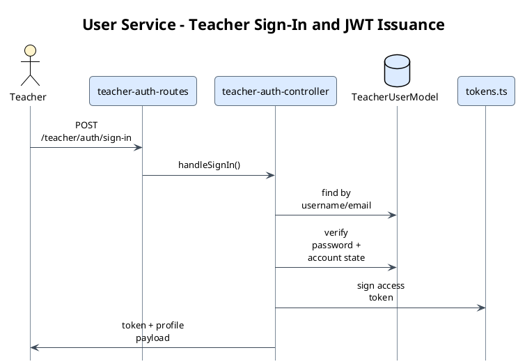
```plantuml
@startuml
title User Service - Teacher Sign-In and JWT Issuance
!theme plain
skinparam backgroundColor #FFFFFF
skinparam defaultFontName Cabin
skinparam shadowing false
skinparam roundCorner 10
skinparam sequenceMessageAlign center
skinparam ArrowColor #3F4C5A
skinparam SequenceLifeLineBorderColor #7D8B99
skinparam SequenceLifeLineBackgroundColor #F6F8FB
skinparam ParticipantBorderColor #5D6D7E
skinparam ParticipantBackgroundColor #EAF1FB
skinparam wrapWidth 160
skinparam maxMessageSize 90
skinparam ParticipantPadding 8
skinparam BoxPadding 6
skinparam Padding 4
skinparam ResponseMessageBelowArrow true
hide footbox

actor Teacher #FFF4CC
participant "teacher-auth-routes" as Route #DCEBFF
participant "teacher-auth-controller" as Ctrl #DCEBFF
database "TeacherUserModel" as UserDB #DCEBFF
participant "tokens.ts" as Tokens #DCEBFF

Teacher -> Route: POST /teacher/auth/sign-in
Route -> Ctrl: handleSignIn()
Ctrl -> UserDB: find by username/email
Ctrl -> UserDB: verify password + account state
Ctrl -> Tokens: sign access token
Ctrl -> Teacher: token + profile payload
@enduml
```

**Password reset and token/OTP lifecycle**

Relevant implementation:

- `services/user-service/src/routes/teacher-auth-routes.ts`
  - Password-reset request/status/reset route handlers.
- `services/user-service/src/controller/teacher-auth-controller.ts`
  - Reset-token lifecycle orchestration and password update flow.
- `services/user-service/src/model/teacher-auth-token-model.ts`
  - Reset token storage, consume-once semantics, and expiry state.
- `services/user-service/src/utils/mail.ts`
  - Reset-link email dispatch.

Flow detail:

1. Teacher requests password reset.
2. Service creates reset token pair (selector + validator pattern).
3. Reset link is sent by email.
4. Client checks token status.
5. Teacher submits new password.
6. Service validates token, updates password hash, and consumes token.

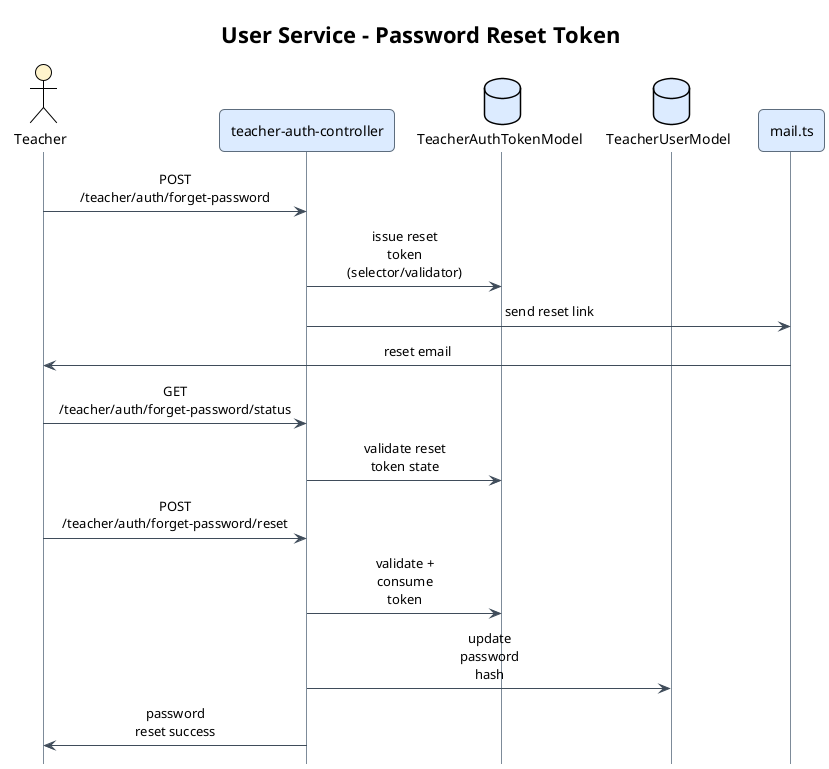
```plantuml
@startuml
title User Service - Password Reset Token
!theme plain
skinparam backgroundColor #FFFFFF
skinparam defaultFontName Cabin
skinparam shadowing false
skinparam roundCorner 10
skinparam sequenceMessageAlign center
skinparam ArrowColor #3F4C5A
skinparam SequenceLifeLineBorderColor #7D8B99
skinparam SequenceLifeLineBackgroundColor #F6F8FB
skinparam ParticipantBorderColor #5D6D7E
skinparam ParticipantBackgroundColor #EAF1FB
skinparam wrapWidth 160
skinparam maxMessageSize 90
skinparam ParticipantPadding 8
skinparam BoxPadding 6
skinparam Padding 4
skinparam ResponseMessageBelowArrow true
hide footbox

actor Teacher #FFF4CC
participant "teacher-auth-controller" as Ctrl #DCEBFF
database "TeacherAuthTokenModel" as TokenDB #DCEBFF
database "TeacherUserModel" as UserDB #DCEBFF
participant "mail.ts" as Mailer #DCEBFF

Teacher -> Ctrl: POST /teacher/auth/forget-password
Ctrl -> TokenDB: issue reset token (selector/validator)
Ctrl -> Mailer: send reset link
Mailer -> Teacher: reset email
Teacher -> Ctrl: GET /teacher/auth/forget-password/status
Ctrl -> TokenDB: validate reset token state
Teacher -> Ctrl: POST /teacher/auth/forget-password/reset
Ctrl -> TokenDB: validate + consume token
Ctrl -> UserDB: update password hash
Ctrl -> Teacher: password reset success
@enduml
```

**Student access token verification for mobile routes**

Relevant implementation:

- `services/user-service/src/middleware/access-control.ts`
  - JWT decode/verify, account-state checks.
- `services/user-service/src/model/student-user-model.ts`
  - Identity resolution for token-authenticated mobile requests.
- `phone-app/src/auth/session.ts`
  - Client side auth and token management.
- `phone-app/src/api/authed.ts`
  - Helper that automatically attaches bearer token to API calls.

Flow detail:

1. Student signs in and obtains bearer token.
2. Phone app persists token in session state.
3. Protected API calls include bearer token.
4. Middleware verifies token, loads student account, enforces account-state checks.
5. Role-scoped handler executes with normalized `req.user`.

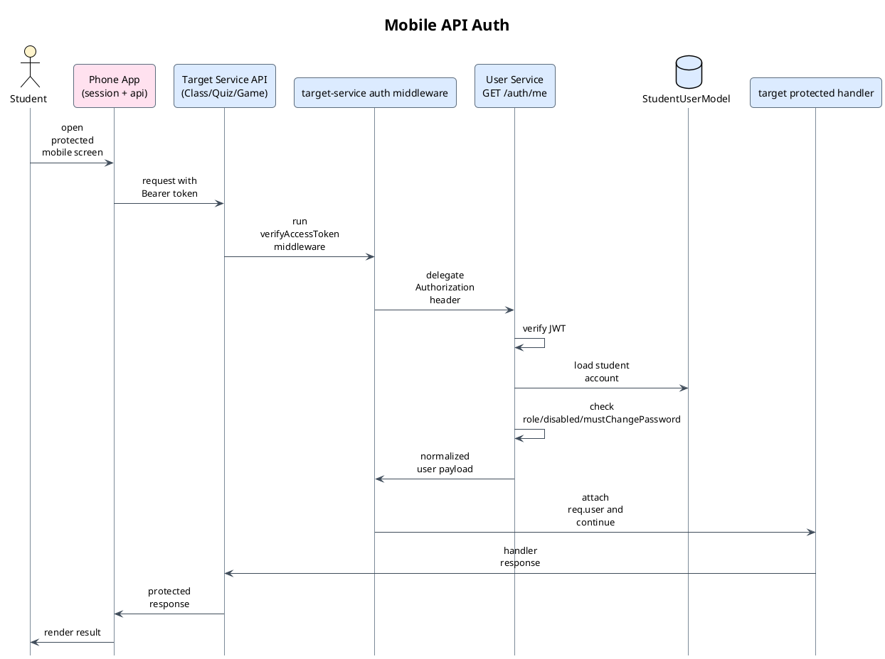
```plantuml
@startuml
title Mobile API Auth
!theme plain
skinparam backgroundColor #FFFFFF
skinparam defaultFontName Cabin
skinparam shadowing false
skinparam roundCorner 10
skinparam sequenceMessageAlign center
skinparam ArrowColor #3F4C5A
skinparam SequenceLifeLineBorderColor #7D8B99
skinparam SequenceLifeLineBackgroundColor #F6F8FB
skinparam ParticipantBorderColor #5D6D7E
skinparam ParticipantBackgroundColor #EAF1FB
skinparam wrapWidth 160
skinparam maxMessageSize 90
skinparam ParticipantPadding 8
skinparam BoxPadding 6
skinparam Padding 4
skinparam ResponseMessageBelowArrow true
hide footbox

actor Student #FFF4CC
participant "Phone App\n(session + api)" as Mobile #FFE1EF
participant "Target Service API\n(Class/Quiz/Game)" as Target #DCEBFF
participant "target-service auth middleware" as AuthMw #DCEBFF
participant "User Service\nGET /auth/me" as UserAuth #DCEBFF
database "StudentUserModel" as StudentDB #DCEBFF
participant "target protected handler" as Endpoint #DCEBFF

Student -> Mobile: open protected mobile screen
Mobile -> Target: request with Bearer token
Target -> AuthMw: run verifyAccessToken middleware
AuthMw -> UserAuth: delegate Authorization header
UserAuth -> UserAuth: verify JWT
UserAuth -> StudentDB: load student account
UserAuth -> UserAuth: check role/disabled/mustChangePassword
UserAuth -> AuthMw: normalized user payload
AuthMw -> Endpoint: attach req.user and continue
Endpoint -> Target: handler response
Target -> Mobile: protected response
Mobile -> Student: render result
@enduml
```

## 3.2 Quiz Service

### 3.2.1 Service Scope

Quiz Service owns:

- Quiz authoring and versioning
- Quiz metadata taxonomies (subjects/topics/type colors)
- Attempt lifecycle and grading
- Schedule-linked quiz selection and variants
- Outbound attempt and quiz lifecycle events

Runtime ownership boundaries:

1. Quiz Service owns attempt and grading outputs.
2. Class Service owns schedule and eligibility checks.
3. Quiz Service queries Class helper endpoints for eligibility and reacts to schedule lifecycle events to invalidate stale attempts.

### 3.2.2 Runtime Entrypoints

- HTTP server:
  - `services/quiz-service/src/server.ts`
- Worker runtime:
  - `services/quiz-service/src/worker.ts`

Worker responsibilities:

- Consume schedule lifecycle events
- Run outbox publisher
- Run Redis attempt-expiry worker

### 3.2.3 Route Surface

Route grouping:

- `quiz-routes.ts` (`/quiz`)
  - Authoring/versioning of quizzes: create, edit, clone, list, read by version family, and internal quiz lookups used by other services.
- `quiz-meta-routes.ts` (`/quiz/meta`)
  - Teacher-owned metadata management (subjects, topics, and type-color related support).
- `quiz-attempt-routes.ts` (`/attempt`)
  - Runtime attempt lifecycle: eligibility-driven spec creation, start/resume, answer updates, finalize/invalidate, and analytics-facing attempt reads.

Controller grouping:

- `quiz-controller.ts`
  - Quiz CRUD/versioning and quiz lifecycle event publishing logic.
- `quiz-attempt-controller.ts`
  - Attempt state machine and scoring orchestration, including Class Service eligibility integration.
- `quiz-meta-controller.ts`
  - Subject/topic metadata APIs and validation.
- `quiz-batch-controller.ts`
  - Internal batch creation/read flows used by AI approval handoff and internal integrations.
- `crossword-generator-controller.ts`
  - Crossword layout generation endpoint used by crossword authoring flows.
- `quiz-structure-controller.ts`
  - Quiz structure metadata endpoints used by AI/document-assisted generation and dynamic authoring support.

### 3.2.4 Core Models

- `quiz-base-model.ts`
  - Canonical quiz definition snapshots, version lineage, and teacher ownership metadata.
- `quiz-attempt-model.ts`
  - Attempt state machine (`in_progress`, `finalized`, invalidation lineage) and scoring attempt snapshots.
- `quiz-meta-model.ts`
  - Teacher-owned categorisation (subjects/topics/type-colour support metadata).
- `schedule-quiz-variant-model.ts`
  - Persisted schedule-specific randomized variants keyed by schedule/root/version identity.
- `outbox-model.ts`
  - Durable outbound event queue for attempt and quiz lifecycle publishing.

Model behaviours:

- `quiz-base-model` is version-snapshot oriented: create/edit flows produce versioned immutable quiz payloads for safe historical replay.
- `quiz-attempt-model` tracks attempt versioning + validity lineage so invalidations can be compensated downstream (`AttemptInvalidated`).
- `schedule-quiz-variant-model` ensures randomized types stay deterministic per schedule, preventing per-attempt drift.

### 3.2.5 Quiz Registry and Type Architecture

- `services/quiz-service/src/model/quiz-registry.ts`

Registered quizzes (via `registerAllQuizzes()`):

- `basic`
  - Standard item-based quiz flow with fixed question set and deterministic grading key.
- `rapid`
  - Time-pressured item flow with per-item pacing semantics and rapid-play rendering.
- `rapid-arithmetic`
  - Parameterized arithmetic generation with computed answer rules instead of static item banks.
- `crossword`
  - Free-form crossword quiz type with generated grid/entry placement payload.
- `crossword-bank`
  - Crossword-bank variant sourced from teacher-maintained word/clue repositories.
- `true-false`
  - Binary item type optimized for lightweight authoring and review presentation.

The registry pattern seperates the core quiz versioning and lifecycle management from type-specific quiz content and grading logic. The design intention is to allow for easy additions of new quiz types without modifying the core quiz logic.

**QuizTypeDef contract in implementation terms**

Implementing a new quiz type requires fulfilling the `QuizTypeDef` interface, which defines the contract for how the quiz service interacts with quiz content and grading logic for that type.

Contract type:

- `services/quiz-service/src/model/quiz-registry.ts` (`QuizTypeDef`)

Methods defined in the contract:

1. `readItemsFromBody(body)`

- Called from quiz create/update controllers to extract raw type payload from request body.
- Typical patterns:
  - `itemsJson` payloads for item-based quizzes.
  - Entries arrays for crossword-based quizzes.
  - Generated config blocks for rapid arithmetic.

2. `coerceItems(raw)`

- Normalizes shape before validation.
- Typical responsibilities:
  - Trim text
  - Normalize booleans/numbers
  - Synthesize missing IDs where needed
  - Enforce deterministic option/entry ordering

3. `validate(body, items)`

- Returns `fieldErrors` and `questionErrors` in the exact shape consumed by web forms.
- This keeps one validation contract shared by web create/edit and AI approval handoff.

4. `buildTypePatch(body, items, fileMap?)`

- Converts validated payload into model patch fields persisted into `QuizBaseModel`.
- Must preserve compatibility with versioning logic (new version rows are whole quiz snapshots).

5. `buildAttemptSpec(quizDoc)`

- Produces `AttemptSpecEnvelope` (`renderSpec` + `gradingKey`) used by phone app play flows.
- Render shape must remain stable because attempts snapshot this spec at start time.

6. `gradeAttempt(spec, answers)`

- Deterministic autoscore function.
- Output feeds both attempt write-path and downstream analytics/event payloads.

7. `aggregateScheduledQuiz(input)`

- Type-specific breakdown for schedule-level stats.
- Used by teacher-facing results pages and class analytics aggregation.

8. `buildScheduleVariant(quizDoc, { scheduleId })` (optional)

- Required for randomized-per-schedule types.
- Persisted through `schedule-quiz-variant-model.ts` so all students in one schedule see a stable variant.

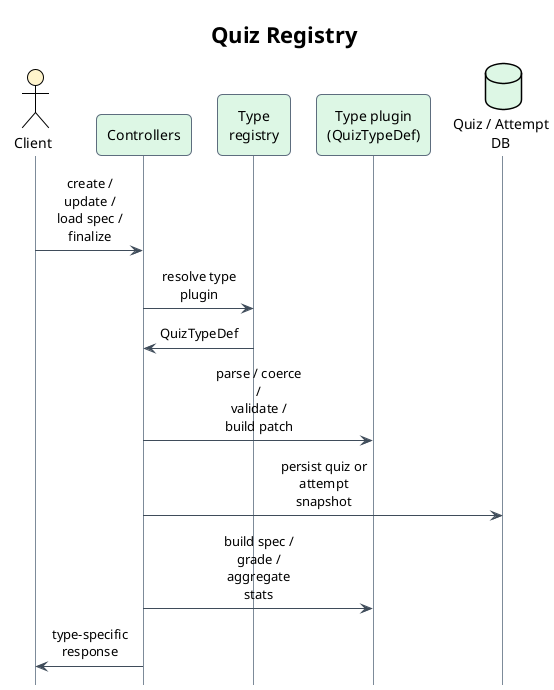
```plantuml
@startuml
title Quiz Registry
!theme plain
skinparam backgroundColor #FFFFFF
skinparam defaultFontName Cabin
skinparam shadowing false
skinparam roundCorner 10
skinparam sequenceMessageAlign center
skinparam ArrowColor #3F4C5A
skinparam SequenceLifeLineBorderColor #7D8B99
skinparam SequenceLifeLineBackgroundColor #F6F8FB
skinparam ParticipantBorderColor #5D6D7E
skinparam ParticipantBackgroundColor #EAF1FB
skinparam wrapWidth 160
skinparam maxMessageSize 90
skinparam ParticipantPadding 8
skinparam BoxPadding 6
skinparam Padding 4
skinparam ResponseMessageBelowArrow true
hide footbox

actor "Client" as Client #FFF4CC
participant "Controllers" as Ctrl #DDF7E5
participant "Type\nregistry" as Registry #DDF7E5
participant "Type plugin\n(QuizTypeDef)" as TypeDef #DDF7E5
database "Quiz / Attempt\nDB" as DB #DDF7E5

Client -> Ctrl: create / update /\nload spec / finalize
Ctrl -> Registry: resolve type\nplugin
Registry -> Ctrl: QuizTypeDef
Ctrl -> TypeDef: parse / coerce /\nvalidate / build patch
Ctrl -> DB: persist quiz or\nattempt snapshot
Ctrl -> TypeDef: build spec / grade /\naggregate stats
Ctrl -> Client: type-specific response
@enduml
```

**Randomized quiz types**

Variant resolution:

- `services/quiz-service/src/utils/schedule-quiz-variant-utils.ts`
- `services/quiz-service/src/model/schedule-quiz-variant-model.ts`

There is a specific contract for randomized quiz types that implement `buildScheduleVariant`. This is used currently in the `rapid-arithmetic` and `crossword bank` quiz types. This method is called during scheduling, and a variant of the randomised quiz is built and stored for that particular schedule. When future attempts are made and an attempt spec is retreived, the persisted variant is used to ensure consistency across attempts for the same schedule.

This guarantees fairness and replayability:

- Students in the same schedule receive consistent content,
- Later review and analytics use the same derived quiz shape,
- Retries/resume do not drift due to regeneration.

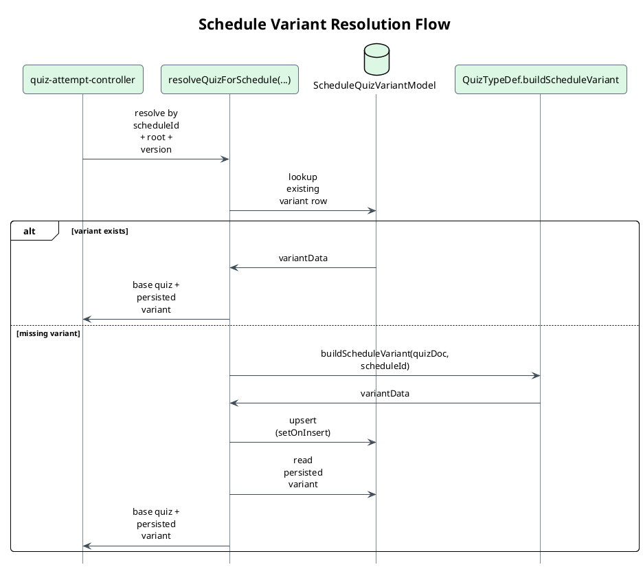
```plantuml
@startuml
title Schedule Variant Resolution Flow
!theme plain
skinparam backgroundColor #FFFFFF
skinparam defaultFontName Cabin
skinparam shadowing false
skinparam roundCorner 10
skinparam sequenceMessageAlign center
skinparam ArrowColor #3F4C5A
skinparam SequenceLifeLineBorderColor #7D8B99
skinparam SequenceLifeLineBackgroundColor #F6F8FB
skinparam ParticipantBorderColor #5D6D7E
skinparam ParticipantBackgroundColor #EAF1FB
skinparam wrapWidth 120
skinparam maxMessageSize 70
skinparam ParticipantPadding 8
skinparam BoxPadding 6
skinparam Padding 4
skinparam ResponseMessageBelowArrow true
hide footbox

participant "quiz-attempt-controller" as AttemptCtrl #DDF7E5
participant "resolveQuizForSchedule(...)" as Resolver #DDF7E5
database "ScheduleQuizVariantModel" as VariantDB #DDF7E5
participant "QuizTypeDef.buildScheduleVariant" as Builder #DDF7E5

AttemptCtrl -> Resolver: resolve by scheduleId + root + version
Resolver -> VariantDB: lookup existing variant row
alt variant exists
  VariantDB -> Resolver: variantData
  Resolver -> AttemptCtrl: base quiz + persisted variant
else missing variant
  Resolver -> Builder: buildScheduleVariant(quizDoc, scheduleId)
  Builder -> Resolver: variantData
  Resolver -> VariantDB: upsert (setOnInsert)
  Resolver -> VariantDB: read persisted variant
  Resolver -> AttemptCtrl: base quiz + persisted variant
end
@enduml
```

**Add-new-quiz-type implementation checklist (full stack)**

Backend registration and model contract:

1. Add new module under `services/quiz-service/src/model/quiz-types/`.
2. Implement full `QuizTypeDef` surface in that module.
3. Register it in `registerAllQuizzes()` in `quiz-registry.ts`.
4. Extend allowed keys in `quiz-shared.ts` (`QUIZ_TYPES`, `QuizTypeKey`, color/label maps).
5. Ensure attempt spec and grading structures are backward-safe for attempt snapshots.

Quiz Service controller touchpoints to verify:

1. `controller/quiz-controller.ts`

- Create/edit/version flows use your parser/coercer/validator/patch methods.

2. `controller/quiz-attempt-controller.ts`

- Spec start/finalize paths call `buildAttemptSpec` and `gradeAttempt`.

3. `controller/quiz-attempt-controller.ts` schedule analytics path

- Confirm `aggregateScheduledQuiz` output is meaningful for teacher dashboards.

4. If randomized:

- Implement and validate `buildScheduleVariant` + purge behaviour on schedule updates.

Web app implementation points:

1. Type definitions:

- `web-app/services/quiz/types/quizTypes.ts`

2. Create route wiring:

- `web-app/app/(app)/quizzes/create/[quizType]/page.tsx`

3. Authoring form:

- Add a new form under `web-app/components/quizzes/quiz-forms/`.

4. Edit/load mapping:

- `web-app/services/quiz/actions/get-quiz-action.ts`

5. Review/view pages:

- Ensure teacher review pages render your type correctly (especially attempt breakdown pages under classes results and attempt viewers).

Phone app implementation points:

1. API unions and parsers:

- `phone-app/src/api/quiz-service.ts`

2. Play routing:

- `phone-app/src/components/screens/QuizPlayCoordinator.tsx`

3. Play UI:

- Add or map a screen in `phone-app/src/components/quiz-components/quiz/play/`.

4. Review UI:

- Wire viewer in `phone-app/src/components/quiz-components/quiz/attempts/AttemptBody.tsx`.

5. Start/result screens:

- Ensure quiz type labels/colors and summary cards are supported in screen-level components.

**Crossword generation algorithm**

Relevant files:

- `services/quiz-service/src/controller/crossword-generator-controller.ts`
- `services/quiz-service/src/utils/crossword/crossword-algorithm.ts`
- `services/quiz-service/src/utils/crossword/compact-crossword.ts`

This generator is a greedy placement algorithm with crossword-style adjacency constraints. It is designed for predictable runtime and stable output shape and it is not attempting to solve an optimal packing problem.

Input validation (controller-level):

1. `words` and `clues` are required in pairwise rows.
2. Max 10 entries per request.
3. Answers must be letters A–Z only, no spaces, length <= 20.
4. Clues must be non-empty.

If validation fails, the endpoint returns structured `fieldErrors` and `questionErrors`, consistent with quiz form error contracts.

Algorithm phases (`generateCrossword`):

1. Sanitize and rank

- Answers are uppercased and stripped to A–Z (`replace(/[^A-Z]/g, "")`).
- Words are sorted longest-first.

2. Initialize blocked grid

- Grid starts as fully blocked cells (`isBlocked=true`, `letter=null`).
- Default size is 20x20

3. Seed first word

- Place longest word near horizontal center.
- If center placement fails, do first-fit scan left-to-right/top-to-bottom across row placements.
- If even first word cannot be placed, return immediately with `unplaced`.

4. Main placement loop (for remaining words)

- Each pass re-sorts pool by:
  - `overlapScore` (how many letters exist somewhere in current grid),
  - Word length descending.
- For each word, `findBestPlacement` tries intersect-based candidates:
  - Finds existing grid cells matching each letter in the word,
  - Projects both across/down starts from those intersections,
  - Checks legality with `canPlaceWord`,
  - Scores candidates by `intersections * 10 - centerDistance`.
- Best-scoring legal candidate is selected and written.

5. Stuck handling (island fallback)

- If no words placed in a full pass:
  - Pick one best island candidate (`pickBestIslandWord`, currently longest-first),
  - If `allowIslandFallback=true`, try nearest legal side placement by centroid distance (`sidePlaceNearest`),
  - If successful, continue loop,
  - Otherwise mark as `unplaced`.

6. Build entry positions

- For each placed row, positions are expanded to per-letter `(row,col)` arrays.

Crossword legality constraints (`canPlaceWord`):

1. Boundary guard

- Placement must stay in bounds.

2. Endcap guard

- Cells immediately before and after word must be empty (unless out of bounds).

3. Collision guard

- Existing letter must either match or placement fails.

4. Side-touch guard

- For non-overlap cells, orthogonal neighbours must be empty.
- This prevents accidental side-adjacent non-crossing words.

Post-processing (`packTopLeftAndCrop`):

1. Find bounding box of all placed letters.
2. Translate puzzle so top-left occupied cell becomes `(0,0)`.
3. Crop to minimal occupied rectangle.
4. Apply same translation to every entry position.

This keeps payload compact for web/phone rendering and avoids large sparse grids in clients.

Returned payload characteristics:

- `grid`: cropped blocked/open-letter matrix.
- `entries`: clue rows with direction + exact coordinates.
- `packedHeight`, `packedWidth`: final render bounds.
- `unplaced`: rows that could not be legally placed.

Greedy logic:

1. An ideal crossword would maximize intersections and minimize area, so the greedy conditions here uses `overlapScore` as primary sort and `centerDistance` as a secondary tie-breaker to encourage the two key desired properties of connectivity and compactness. However, these are not perfect heuristics and serve as a best-effort approach to a complex combinatorial problem.

Known algorithm tradeoffs:

1. Not an optimal packing algorithm, so placement rate depends on input. Longer words with more common letters tend to place better and create more intersections, which opens up more candidates for remaining words.
2. Allowing one-at-a-time island fallback increases placement rate but will likely produce 2 distinct clusters of words instead of one connected mass.
3. Quality depends on input overlap quality (shared letters) and word length distribution.

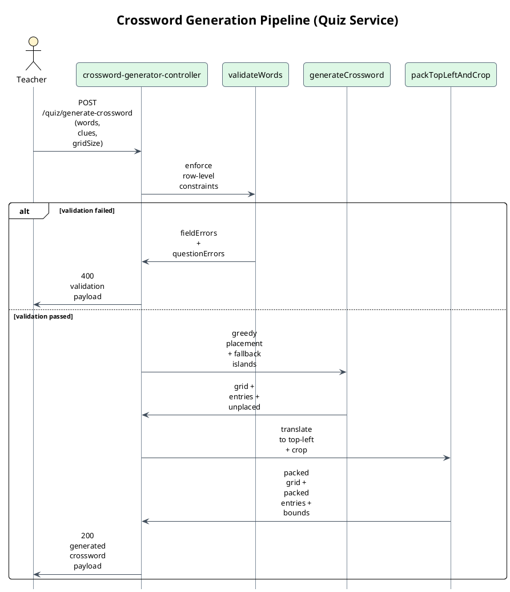
```plantuml
@startuml
title Crossword Generation Pipeline (Quiz Service)
!theme plain
skinparam backgroundColor #FFFFFF
skinparam defaultFontName Cabin
skinparam shadowing false
skinparam roundCorner 10
skinparam sequenceMessageAlign center
skinparam ArrowColor #3F4C5A
skinparam SequenceLifeLineBorderColor #7D8B99
skinparam SequenceLifeLineBackgroundColor #F6F8FB
skinparam ParticipantBorderColor #5D6D7E
skinparam ParticipantBackgroundColor #EAF1FB
skinparam wrapWidth 160
skinparam maxMessageSize 70
skinparam ParticipantPadding 8
skinparam BoxPadding 6
skinparam Padding 4
skinparam ResponseMessageBelowArrow true
hide footbox

actor Teacher #FFF4CC
participant "crossword-generator-controller" as Ctrl #DDF7E5
participant "validateWords" as Validate #DDF7E5
participant "generateCrossword" as Algo #DDF7E5
participant "packTopLeftAndCrop" as Pack #DDF7E5

Teacher -> Ctrl: POST /quiz/generate-crossword (words, clues, gridSize)
Ctrl -> Validate: enforce row-level constraints
alt validation failed
  Validate -> Ctrl: fieldErrors + questionErrors
  Ctrl -> Teacher: 400 validation payload
else validation passed
  Ctrl -> Algo: greedy placement + fallback islands
  Algo -> Ctrl: grid + entries + unplaced
  Ctrl -> Pack: translate to top-left + crop
  Pack -> Ctrl: packed grid + packed entries + bounds
  Ctrl -> Teacher: 200 generated crossword payload
end
@enduml
```

### 3.2.6 Attempt Lifecycle Logic

Primary controller:

- `services/quiz-service/src/controller/quiz-attempt-controller.ts`

Key behaviour:

1. Student requests attempt spec with `scheduleId`.
2. Quiz Service uses S2S endpoint to call Class Service for checking attempt eligibility.
3. Quiz version is resolved using `(quizRootId, quizVersion)`.
4. Existing in-progress attempts that have not timed out are resumable.
5. Finalization emits `AttemptFinalized`

Attempt state-machine details:

1. Attempt spec call resolves a stable render/grading envelope, then start/resume writes an `in_progress` attempt snapshot.
2. Save calls persist answer deltas without grading side effects.
3. Finalize call performs deterministic grading through quiz-type contract, persists breakdown + score, and enqueues `AttemptFinalized` outbox event.
4. Invalidation flow marks attempts invalid without deleting records, preserving lineage for replay and analytics compensation.
5. Expired attempts are finalized by Redis deadline worker (see `section 2.4`) to prevent hanging `in_progress` rows.

### 3.2.7 Schedule Event Consumption

Consumer:

- `services/quiz-service/src/events/incoming/schedule-events-consumer.ts`

Controller:

- `services/quiz-service/src/events/incoming/schedule-events-controller.ts`

Responsibilities:

1. Keep attempt validity aligned with schedule truth owned by Class Service.

- In `version_bumped` flows, attempts linked to the old schedule version are invalidated.
- In `deleted` flows, all attempts linked to that schedule are invalidated.

2. Remove stale schedule-linked randomized variants

- In `version_bumped` flows, variants linked to the old schedule version are deleted so they won't be used in future attempt specs.
- In `deleted` flows, all variants linked to that schedule are deleted.

3. Emit compensating invalidation events so downstream projections can unwind previous effects.

Attempts are the base unit of projection for Class Service analytics and Game Service progression flows. Keeping attempt
validity aligned with schedule truth is critical for overall system consistency.

### 3.2.8 Outbound Event Model

Outbound event builders:

- `attempt-events.ts`
- `quiz-events.ts`

Event categories:

- Attempt stream:
  - `AttemptFinalized`
  - `AttemptInvalidated`
- Quiz lifecycle stream:
  - `QuizDeleted`
  - `QuizMetaUpdated`
  - `QuizVersionUpdated`
- Schedule lifecycle stream:
  - `ScheduleUpdated`

Event intent:

- `AttemptFinalized`
  - Announces a canonical candidate attempt outcome so Class/Game can update projections.
- `AttemptInvalidated`
  - Compensating event used when previously finalized attempts are no longer valid after lifecycle changes. Used to trigger
    downstream consistency updates in Class/Game projections and analytics.
- `QuizDeleted`, `QuizMetaUpdated`, `QuizVersionUpdated`
  - Lifecycle contract for Class Service to update or delete schedules
- `ScheduleUpdated`
  - Used where quiz-side schedule-linked lifecycle effects must be propagated for downstream consistency.

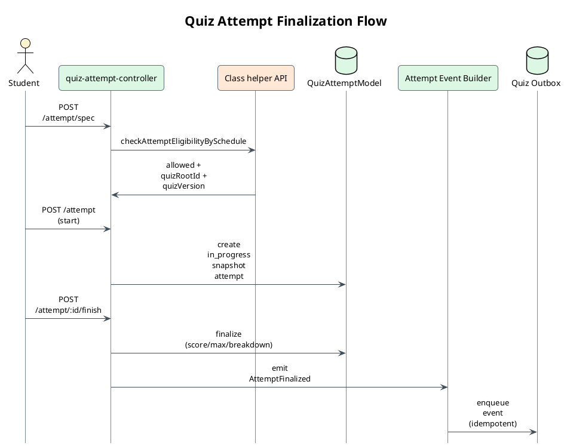
```plantuml
@startuml
title Quiz Attempt Finalization Flow
!theme plain
skinparam backgroundColor #FFFFFF
skinparam defaultFontName Cabin
skinparam shadowing false
skinparam roundCorner 10
skinparam sequenceMessageAlign center
skinparam ArrowColor #3F4C5A
skinparam SequenceLifeLineBorderColor #7D8B99
skinparam SequenceLifeLineBackgroundColor #F6F8FB
skinparam ParticipantBorderColor #5D6D7E
skinparam ParticipantBackgroundColor #EAF1FB
skinparam wrapWidth 160
skinparam maxMessageSize 90
skinparam ParticipantPadding 8
skinparam BoxPadding 6
skinparam Padding 4
skinparam ResponseMessageBelowArrow true
hide footbox

actor Student #FFF4CC
participant "quiz-attempt-controller" as AttemptCtrl #DDF7E5
participant "Class helper API" as ClassHelper #FFE9D6
database "QuizAttemptModel" as AttemptDB #DDF7E5
participant "Attempt Event Builder" as EventBuilder #DDF7E5
database "Quiz Outbox" as Outbox #DDF7E5

Student -> AttemptCtrl: POST /attempt/spec
AttemptCtrl -> ClassHelper: checkAttemptEligibilityBySchedule
ClassHelper -> AttemptCtrl: allowed + quizRootId + quizVersion
Student -> AttemptCtrl: POST /attempt (start)
AttemptCtrl -> AttemptDB: create in_progress snapshot attempt
Student -> AttemptCtrl: POST /attempt/:id/finish
AttemptCtrl -> AttemptDB: finalize (score/max/breakdown)
AttemptCtrl -> EventBuilder: emit AttemptFinalized
EventBuilder -> Outbox: enqueue event (idempotent)
@enduml
```

### 3.2.9 Quiz and Schedule Lifecycle Cascade Handling

This is the high-impact consistency path that links Quiz Service and Class Service.

Quiz lifecycle -> Class schedule updates:

1. Quiz Service emits quiz lifecycle events (`QuizDeleted`, `QuizMetaUpdated`, `QuizVersionUpdated`) on `quiz.lifecycle.v1`.
2. Class Service consumes these and identifies affected schedules.
3. Class Service updates/removes schedule entries as needed.
4. Class Service emits schedule lifecycle updates on `class.schedule.v1`.
5. Quiz Service consumes schedule lifecycle updates and invalidates affected attempts via `AttemptInvalidated`.

Schedule edits/deletes -> attempt invalidation:

1. Class Service emits `ScheduleUpdated` (`version_bumped` or `deleted`) on `class.schedule.v1`.
2. Quiz Service consumes and invalidates attempts tied to stale schedule/quiz-version links.
3. Downstream analytics/gamification layers reconcile from the resulting attempt and canonical events.

This cascade is why schedule and quiz updates are treated as lifecycle events rather than local mutations.

## 3.3 Class Service

### 3.3.1 Service Scope

Class Service owns:

- Classes and roster lifecycle
- Schedule lifecycle
- Teacher/student helper checks
- Class and student projections
- Canonical attempt computation and contribution-weighted analytics

Ownership boundaries:

1. Class Service is source-of-truth for class roster and schedule lifecycle.
2. It computes canonical analytics state for teaching views.
3. It emits lifecycle and canonical events consumed by Game Service.

### 3.3.2 Runtime Entrypoints

- HTTP:
  - `services/class-service/src/server.ts`
- Worker:
  - `services/class-service/src/worker.ts`

Worker responsibilities:

- Consume quiz attempt/lifecycle events
- Run outbox publisher

### 3.3.3 Route Surface

Route grouping:

- `class-routes.ts`
  - Class lifecycle operations (create/update/delete/list) and class related queries.
- `class-student-routes.ts`
  - Roster management (add/remove/list class students).
- `schedule-routes.ts`
  - Schedule handling (Add/edit/remove) quizzes with attempt policies.
- `student-routes.ts`
  - Student-centric APIs that the student facing mobile app uses.
- `helper-routes.ts`
  - Internal S2S authority/eligibility checks.
- `image-routes.ts`
  - Class-related media/image operations.

Controller grouping:

- `class-controller.ts`
  - Class lifecycle and class-level settings.
- `class-student-controller.ts`
  - Roster operations and class-scoped student mutations.
- `schedule-controller.ts`
  - Schedule create/edit/delete with transactional guarantees and schedule lifecycle events.
- `students-controller.ts`
  - Student-facing reads assembled for dashboards and detail views.
- `helper-controller.ts`
  - Internal helper checks used by Quiz/Game services.
- `stats-controller.ts`
  - Projection update paths (canonical reconciliation, contribution scoring, attendance/streak handling).

Helper routes:

- Helper endpoints are internal routes for Quiz & Game services:
  - Schedule attempt eligibility checks
  - Teacher-of-class/schedule/student ownership checks
  - Answer-visibility checks

### 3.3.4 Data Models

- Class:
  - `model/class/class-model.ts`
    - Class metadata, ownership, timezone, and class-level configuration state.
- Students:
  - `model/students/student-model.ts`
    - Roster entries linked to classes.
- Stats:
  - `model/stats/student-stats-model.ts`
    - Per-student projection state based on canonical attempts.
  - `model/stats/scheduled-quiz-stats-model.ts`
    - Aggregate stats for individual scheduled quizzes.
  - `model/stats/stats-bucket-model.ts`
    - Shared bucket schema used for subject/topic aggregation projections.
- Attempts mirror:
  - `model/events/class-attempt-model.ts`
    - Local mirrored attempt records used for idempotent projection replay.
- Outbox and inbound event ledger (for deduplication):
  - `model/events/outbox-model.ts`
    - Durable outbound class/canonical event queue.
  - `model/events/inbound-quiz-event-model.ts`
    - Inbound deduplication ledger for consumed quiz events.

### 3.3.5 Schedule Management Logic

Core controller:

- `services/class-service/src/controller/schedule-controller.ts`

Important behaviour:

- Canonical identity first (`quizRootId + quizVersion`) and concrete `quizId` as derived metadata.
- Conflict checks performed per canonical identity and time overlap.
- Schedule creation/edit/removal wrapped in Mongo transactions.
- Version bumps and deletions emit `ScheduleUpdated` lifecycle events for Quiz Service consumers.

Transactional guarantees:

1. create/edit/delete schedule operations run inside Mongo transactions so schedule mutation + event enqueue stay atomic.
2. contribution edits trigger in-transaction projection reweighting (`stats_onScheduleContributionChanged`) rather than full replay.
3. deletions trigger schedule removal projection cleanup (`stats_onScheduleRemoved`) before lifecycle events are emitted.

### 3.3.6 Analytics and Projection Logic

Core projection controller:

- `services/class-service/src/controller/stats-controller.ts`

Key mechanisms:

1. For every schedule, exactly one canonical attempt contributes to the student's `overallScore` and subject/topic buckets.

- Current implementation selects the best attempt by `scorePct` (score/maxScore) as canonical, but this is a policy choice that can be adjusted without changing the underlying data model or event structure.
- Canonical attempts are recalculated on every attempt finalization and invalidation. Analytics are only updated on a canonical change.

2. `overallScore` is a contribution-weighted sum of canonical attempt scores across schedules, where score contribution is determined by the schedule's `contribution` field defined by the teacher at schedule creation time. Changes to the schedule contribution cause proportional adjustments to the `overallScore` without needing to replay all attempt events.
3. Subject/topic bucket analytic projections, updated with incremental deltas on canonical changes.
4. Schedule-level aggregated stats for participation and grade distributions, also makes use of canonical deltas.

Canonical event emission for downstream consumers (mainly Game Service that updates game progression and leaderboard states).

- `CanonicalUpserted`
- `CanonicalRemoved`

Canonicals are an important key in maintaining consistency in the analytics, as each student should only have a singular contribution to all stats for each schedule, regardless
of how many attempts that student has made for the schedule.

Event ordering safeguards:

1. inbound quiz events are deduped by event ID in `inbound-quiz-event-model`.
2. attempt mirror (`class-attempt-model`) is updated first; projection changes are derived from mirror + canonical policy.
3. canonical upsert/remove events are emitted only after projection state is successfully applied.

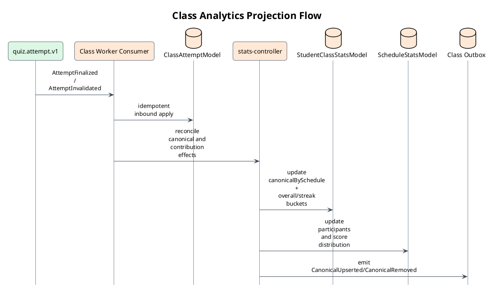
```plantuml
@startuml
title Class Analytics Projection Flow
!theme plain
skinparam backgroundColor #FFFFFF
skinparam defaultFontName Cabin
skinparam shadowing false
skinparam roundCorner 10
skinparam sequenceMessageAlign center
skinparam ArrowColor #3F4C5A
skinparam SequenceLifeLineBorderColor #7D8B99
skinparam SequenceLifeLineBackgroundColor #F6F8FB
skinparam ParticipantBorderColor #5D6D7E
skinparam ParticipantBackgroundColor #EAF1FB
skinparam wrapWidth 160
skinparam maxMessageSize 90
skinparam ParticipantPadding 8
skinparam BoxPadding 6
skinparam Padding 4
skinparam ResponseMessageBelowArrow true
hide footbox

participant "quiz.attempt.v1" as AttemptTopic #DDF7E5
participant "Class Worker Consumer" as Consumer #FFE9D6
database "ClassAttemptModel" as AttemptMirror #FFE9D6
participant "stats-controller" as Stats #FFE9D6
database "StudentClassStatsModel" as StudentStats #FFE9D6
database "ScheduleStatsModel" as ScheduleStats #FFE9D6
database "Class Outbox" as Outbox #FFE9D6

AttemptTopic -> Consumer: AttemptFinalized / AttemptInvalidated
Consumer -> AttemptMirror: idempotent inbound apply
Consumer -> Stats: reconcile canonical and contribution effects
Stats -> StudentStats: update canonicalBySchedule + overall/streak buckets
Stats -> ScheduleStats: update participants and score distribution
Stats -> Outbox: emit CanonicalUpserted/CanonicalRemoved
@enduml
```

## 3.4 AI Service

### 3.4.1 Service Scope

AI Service manages an asynchronous generation workflow from teacher requests.

Scope boundaries:

1. Accept generation requests and create tracked jobs with teacher-scoped quota checks.
2. Parse and classify uploaded reference documents (syllabus, question-bank, content, other).
3. Orchestrate planning + per-quiz generation across supported model providers.
4. Persist draft outputs with detailed progress/diagnostics for teacher review.
5. Apply teacher edits/approvals to persisted drafts
6. Persist approved drafts to Quiz Service using batch APIs.

AI Service does not own quiz runtime/attempt logic at all. It pulls metadata from Quiz Service for generation and pushes approved drafts back.

### 3.4.2 Runtime Entrypoints and Routes

- Server:
  - `services/ai-service/src/server.ts`
- App:
  - `services/ai-service/src/index.ts`
- Routes:
  - `services/ai-service/src/routes/generation-routes.ts`

Route grouping:

- Job creation and orchestration endpoints (`POST /generate`, `GET /generate*`)
  - Start jobs, query job lists/status, and monitor pending work.
- Governance endpoints (`GET /generate/models`, `GET /generate/quota`)
  - Expose provider/model availability and per-teacher quota state.
- Draft curation endpoints (`PATCH /generate/:jobId/quizzes/:tempId`, `POST /generate/:jobId/approve`)
  - Support teacher-in-the-loop edits and selective approval.
- Cleanup/delete endpoints (`DELETE /generate/:jobId`, cleanup routes)
  - Remove generation artefacts while preserving already persisted quizzes downstream.

Controller grouping:

- `generation-controller.ts`
  - End-to-end job lifecycle handlers (start, poll, edit draft, approve, cleanup/delete).
- `generation-controller-helpers.ts`
  - Shared normalization and aggregation helpers used to keep controller handlers thin and consistent.

### 3.4.3 Data Model and Status Machine

Models:

- `generation-job-model.ts`
  - End-to-end generation job state: config snapshot, progress, per-quiz outputs, and approval results.
- `generation-quota-model.ts`
  - Teacher quota windows and reservation counters used to enforce generation limits safely.

Job status progression:

- `pending -> processing -> completed`
  or
- `pending/processing -> failed`

The model stores:

- Config snapshot
- Parsed document metadata
- Per-quiz draft progress and analytics
- Approval/persistence results

### 3.4.4 Document Processing Pipeline

Parser:

- `services/ai-service/src/services/document-parser.ts`

Capabilities and:

- Accepts PDF, DOCX, and TXT.
- PDF extraction runs normal text parsing first, then conditionally triggers OCR only when extraction quality is low.
- OCR trigger conditions:
  - Very low total extracted words.
  - Low average words per page.
  - High ratio of sparse pages (pages below low-word threshold).
- OCR fallback uses `pdftoppm` + `tesseract`, and OCR output is only accepted when it improves extracted word coverage compared to normal extraction.
- Parser returns structured metadata used later in generation diagnostics:
  - `wordCount`
  - `pageCount`
  - `charCount`
  - `ocrApplied`

Context builder:

- `services/ai-service/src/services/document-context-builder.ts`

Context shaping:

- Each uploaded document is normalised into one of four types:
  - `syllabus`
  - `question-bank`
  - `subject-content`
  - `other`
- Type-specific chunking rules are used:
  - Question-bank documents are preferentially split by question-like boundaries.
  - Other document types are split by sentence boundaries.
- Rotating per-quiz chunks are built so quiz #1, #2, #3... do not all see the exact same source slice.
- Each per-quiz context block includes:
  - Teacher instructions
  - Explicit document-handling guidance (what to treat as hard constraints vs exemplars)
  - Batch position (quiz N / total)
  - Selected syllabus constraints + subject content + question-bank exemplars + additional references

This reduces repetitive outputs across a batch as each quiz gets a different view of source material and instructions.

### 3.4.5 Generation Orchestration

Main service:

- `services/ai-service/src/services/quiz-generator.ts`

The generator uses two-passes:

1. Planning pass (`buildBatchPlan`)

- One LLM call produces a strict blueprint for the full batch.
- Expected schema per quiz includes:
  - `quizNumber`
  - `quizType`
  - `focus`
  - `angle`
  - `mustCover[]`
  - `avoidOverlap[]`
  - Optional `titleHint` / `topicHint`
  - Output is validated and normalised by `normalizeBatchPlan`:
  - Every quiz number must exist.
  - Quiz type must match the pre-locked quiz-type plan.
  - Focus must be unique across quizzes.
  - Required fields must be present and bounded.

2. Guided generation pass (`generateInParallel`)

- Each quiz is generated in parallel with a blueprint-guided prompt built by `buildGuidedContent`.
- The guided prompt includes:
  - This quiz’s required focus/angle/must-cover/avoid-overlap.
  - Other quiz focuses to avoid duplication.
  - Source context block.
  - Generation runs with bounded concurrency configured by the env var `AI_PARALLEL_LIMIT`.
  - Each quiz has its own retry loop (`MAX_RETRIES = 5`).

3. Transform and enforcement pass (`transformToQuizFormat`)

- Normalises returned shape into draft schema specific to quiz type.
- Enforces exact question/entry count.
- Enforces metadata constraints:
  - Subject fixed to teacher-selected subject.
  - Topic required from model output.
  - Name/topic cannot contain batch numbering markers.
  - Crossword-specific logic:
  - Hard cap of 10 entries.
  - Grid generation through crossword generator endpoint path.

**Provider abstraction and model routing**

LLM abstraction:

- `services/ai-service/src/services/llm-client.ts`
- `services/ai-service/src/services/ai-model-catalog.ts`

Supported providers:

- OpenAI
- Anthropic
- Gemini

Provider routing model:

- Model selection is resolved through `resolveSelectedAIModel(config.aiModel)`.
- Only models with configured API keys are selectable (`getAvailableAIModels`).
- Provider-specific calls are isolated in `llm-client.ts`:
  - OpenAI chat completions (JSON mode)
  - Anthropic messages
  - Gemini generateContent
- All providers are normalised into one internal result shape:
  - Parsed JSON payload
  - Raw text
  - Unified metrics (`provider`, `model`, `llmLatencyMs`, token usage, optional request ID)

**Parallelism, retry, and partial success model**

Retry and completion behaviour:

1. planning retry count is controlled by `AI_PLANNING_MAX_RETRIES` (minimum 1).
2. per-quiz generation retry count is internal (`MAX_RETRIES = 5`).
3. retries use exponential backoff.
4. Failures are isolated per quiz and individual generation failures do not abort the whole batch.
5. batch completes with mixed outcomes (`successful`, `failed`) and successful drafts are editable/approvable.

This avoids all-or-nothing failure for large generation batches.

### 3.4.6 Quota and Safety Controls

For cost limitations and to prevent abuse, there is an activatable quota system that limits how many generation jobs a teacher can run.

Quota enforcement:

- `services/ai-service/src/services/generation-quota.ts`

Controller behaviour in `startGeneration`:

- Reserves quota before job creation
- Releases reservation on startup failure
- Returns `429` when quota exceeded

Quota semantics:

- Quota can be enabled/disabled with `AI_TEACHER_GENERATION_QUOTA_ENABLED`.
- Per-teacher ceiling is `AI_TEACHER_GENERATION_QUOTA_MAX_JOBS`.
- Usage is persisted in `generation-quota-model.ts` and seeded from historical job count on first read.
- Consumption is concurrency-safe (`findOneAndUpdate` with guard + duplicate-key retry path).

Additional guardrails in `startGeneration`:

- Hard validation of `subject` presence.
- Hard rejection of direct `topic` input (topic must be generated by model).
- Quiz-type allowlist parsing.
- Generation-size limits loaded from `generation-limits.ts`:
  - `AI_MAX_QUIZZES_PER_GENERATION`
  - `AI_MAX_QUESTIONS_PER_QUIZ`
- Model availability gate (must map to a provider with configured API key).

### 3.4.7 Approval Handoff to Quiz Service

Service bridge:

- `services/ai-service/src/services/quiz-service-client.ts`

After review, approved drafts are posted in batch to Quiz Service internal endpoints and tracked back on the generation job.

Approval flow behaviour:

1. Teacher can patch individual drafts before approval.
2. Approval can select some quizzes from a batch and leave other quizzes unapproved.
3. Selected drafts are transformed into Quiz Service compatible payloads uses an internal S2S batch-create endpoint.
4. Approved and saved quiz IDs are written back to job documents in AI Service for traceability.
5. Quiz status transitions to `approved` in AI job record after success in handover.
6. Deleting an AI job will not delete already-approved quizzes in Quiz Service.

### 3.4.8 Async Job UX Contract (Web Dashboard Integration)

The generation API contract is intentionally asynchronous to support better usability:

1. `POST /generate` returns quickly after job creation (`pending`).
2. background worker transitions job to `processing`.
3. web dashboard polls job status (`GET /generate/:jobId` and list endpoints).
4. job ends in `completed` or `failed`.
5. drafts can be edited and selectively approved after completion.

This allows teachers to leave and return later without blocking the browser session on long generation runs.

Actual worker phases in `processGenerationJob(jobId)`:

1. mark job `processing`, persist `startedAt`.
2. parse optional documents and build per-quiz contexts.
3. fetch live quiz structure + AI prompting rules from Quiz Service (`/quiz/structure-and-rules`).
4. run two-pass generation with progress callback updates.
5. persist generation result set + analytics.
6. mark job `completed` with `completedAt`, or `failed` with error message.

Progress updates are intentionally debounced before DB writes to avoid save contention during parallel generation bursts.

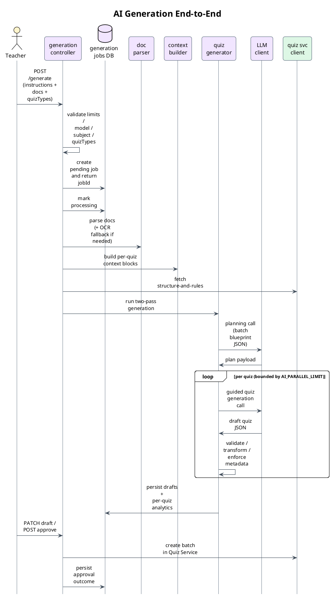
```plantuml
@startuml
title AI Generation End-to-End
!theme plain
skinparam backgroundColor #FFFFFF
skinparam defaultFontName Cabin
skinparam shadowing false
skinparam roundCorner 10
skinparam sequenceMessageAlign center
skinparam ArrowColor #3F4C5A
skinparam SequenceLifeLineBorderColor #7D8B99
skinparam SequenceLifeLineBackgroundColor #F6F8FB
skinparam ParticipantBorderColor #5D6D7E
skinparam ParticipantBackgroundColor #EAF1FB
skinparam wrapWidth 160
skinparam maxMessageSize 90
skinparam ParticipantPadding 8
skinparam BoxPadding 6
skinparam Padding 4
skinparam ResponseMessageBelowArrow true
hide footbox

actor Teacher #FFF4CC
participant "generation\ncontroller" as Ctrl #F1E5FF
database "generation\njobs DB" as JobDB #F1E5FF
participant "doc\nparser" as Parser #F1E5FF
participant "context\nbuilder" as Ctx #F1E5FF
participant "quiz\ngenerator" as Gen #F1E5FF
participant "LLM\nclient" as LLM #F1E5FF
participant "quiz svc\nclient" as QuizSvc #DDF7E5

Teacher -> Ctrl: POST /generate\n(instructions + docs + quizTypes)
Ctrl -> Ctrl: validate limits /\nmodel / subject / quizTypes
Ctrl -> JobDB: create pending job\nand return jobId
Ctrl -> JobDB: mark processing
Ctrl -> Parser: parse docs\n(+ OCR fallback if needed)
Ctrl -> Ctx: build per-quiz\ncontext blocks
Ctrl -> QuizSvc: fetch structure-and-rules
Ctrl -> Gen: run two-pass generation
Gen -> LLM: planning call\n(batch blueprint JSON)
LLM -> Gen: plan payload
loop per quiz (bounded by AI_PARALLEL_LIMIT)
  Gen -> LLM: guided quiz generation call
  LLM -> Gen: draft quiz JSON
  Gen -> Gen: validate / transform /\nenforce metadata
end
Gen -> JobDB: persist drafts +\nper-quiz analytics
Teacher -> Ctrl: PATCH draft /\nPOST approve
Ctrl -> QuizSvc: create batch in Quiz Service
Ctrl -> JobDB: persist approval outcome
@enduml
```

## 3.5 Game Service

### 3.5.1 Service Scope

Game Service owns:

- Gamification projections from event streams
- Leaderboard calculations
- Reward rules and automatic grants
- Badge progression and periodic top badges
- Avatar and badge rendering endpoints

### 3.5.2 Runtime Entrypoints

- HTTP:
  - `services/game-service/src/server.ts`
- Worker:
  - `services/game-service/src/worker.ts`

Worker responsibilities:

- Consume events
- Run badge awarding scheduler for periodic badges (e.g. top leaderboard badges every week).

### 3.5.3 Route Surface

Routes:

- `services/game-service/src/routes/game-routes.ts`

Route grouping:

- Leaderboard/profile
  - Class leaderboard and student game-profile projections for teacher and student surfaces.
- Reward
  - Reward catalog reads plus class-scoped reward/badge config and rule management.
- Inventory/display management
  - Equip, inventory mutation, and display badge selection endpoints.
- Notification/reward history
  - Unread counts, feed listing, and per-attempt reward acknowledgement flows.
- Rendering endpoints
  - Avatar and badge SVG generation APIs consumed by web/phone clients.

Controller grouping:

- `game-controller.ts`
  - Core game projection read APIs (leaderboards, profile projections, class/student game views).
- `rewards-controller.ts`
  - Reward rules, inventory operations, grants/revokes, badge display, and render endpoints.
- `game-controller-helpers.ts` and `rewards-controller-helpers.ts`
  - Payload shaping, asset resolution, and normalization helpers shared by API handlers.

### 3.5.4 Projection and Ranking Logic

Projection core:

- `services/game-service/src/events/projection-controller.ts`

Projection state machine (code-level behaviour):

1. Attempt ingestion path (`game_onAttemptFinalized`)

- Resolves class timezone from `GameClassStateModel`.
- Computes rank snapshot _before_ mutation (`getStudentRankSnapshot`).
- Applies canonical replacement only when score is better than previous canonical for the same schedule (Same logic as class service for analytics).
- Tie policy is deterministic: equal score does not replace canonical.
- Attendance is recorded (`attendanceDays.YYYY-MM-DD = true`).
- Streak/best-streak is computed from attendance ledger.
- Writes attempt outcome delta (`overallScoreBefore/After`, `rankBefore/After`) to `GameAttemptOutcomeModel`.

2. Invalidation path (`game_onAttemptInvalidated`)

- System only acts if invalidated attempt is currently canonical for that schedule.
- Selects next canonical candidate from valid attempts using stable sort:
  - `score desc`
  - `finishedAt desc`
  - `attemptVersion desc`
  - `attemptId desc`
  - Applies canonical removal/upsert and re-runs reward + badge evaluation.
  - Attendance/streak are intentionally untouched during invalidation. This means that once a day is "attended" it stays attended even if the canonical attempt for that day is later invalidated. This simplifies the logic and avoids streak-breaking invalidations due to schedule changes or attempt expirations.

3. Canonical event path (`game_onCanonicalUpserted` / `game_onCanonicalRemoved`)

- Consumes authoritative class canonical events and applies canonical state directly.
- Computes weighted overall deltas with schedule contribution.
- Triggers reward and badge recomputation inside the same transaction.
- This path serves mainly as redundancy, as the canonical replacement logic in the attempt ingestion path should already keep the projection state consistent. However, it can help catch any edge cases where canonical state might get out of sync and ensures that canonical events are consistent throughout both Class and Game services.

**Projection data model and tie-break policy for leaderboards**

Projection model:

- `services/game-service/src/model/stats/game-student-stats-model.ts`

Important fields:

- `overallScore`
  - Contribution-weighted score aggregate (not simple average).
- `canonicalBySchedule`
  - Map of schedule -> canonical snapshot (`attemptId`, `score`, `maxScore`, `finishedAt`, optional `subject/topic`).
- `attendanceDays`
  - Append-only day ledger used for streak recomputation.
- `streakDays`, `bestStreakDays`, `lastStreakDate`
  - Derived state for leaderboard + badge thresholds.

Rank/tie policy in `getStudentRankSnapshot`:

- Sort key 1: `overallScore` descending.
- Sort key 2: current streak descending (where current streak is valid only if `lastStreakDate` is today/yesterday in class timezone).
- Sort key 3: `studentId` lexicographic ascending for deterministic final tie-break.

This avoids leaderboard flicker between refreshes and keeps ordering stable under replay.

### 3.5.5 Rewards and Badges

Reward engine:

- `services/game-service/src/rewards/reward-engine.ts`

Badge logic:

- `services/game-service/src/rewards/badge-engine.ts`
- `services/game-service/src/rewards/badge-period-finalizer-scheduler.ts`

Asset catalog and compatibility:

- `services/game-service/src/rewards/default-catalog.ts`
- `services/game-service/src/rewards/avatar-generator.ts`

Reward engine internals:

1. Default seeding and class bootstrap

- `ensureDefaultRewardRules(classId)` seeds baseline rule templates.
- `ensureScoreThresholdConfig(classId)` seeds score-threshold reward settings.
- Class lifecycle creation path also ensures inventories and badge config.

2. Rule-trigger evaluation

- Trigger types include:
  - `overall_score_gte`
  - `best_streak_gte`
  - `participation_count_gte`
  - Metrics source is projection state (`overallScore`, `bestStreakDays`, canonical map size).
  - Reward grants are idempotent by rule/grant key and source metadata.

3. Score-threshold rewards

- Threshold progression controlled by `pointsPerReward`.
- Reward candidate is selected from unowned cosmetics first, then fallback pool.
- Grants are deduped by `(classId, studentId, source=score_threshold, thresholdPoints)`.

4. Inventory normalization and compatibility

- Legacy equip aliases are normalised.
- Compulsory slots are enforced.
- Slot occupancy and base-model compatibility are enforced before persist.
- Avatar composition + render URL are regenerated whenever inventory/equipment changes.

**Inventory and display constraints**

Inventory model:

- `services/game-service/src/model/rewards/game-student-inventory-model.ts`

Important constraints:

1. display badges capped (max 4).
2. displayed badges must be owned.
3. equip compatibility is normalized by avatar base model/slot.
4. teacher badge grants are intentionally restricted by controller policy.

Controller enforcement details:

- `updateStudentInventory` rejects attempts to revoke default-owned cosmetics.
- Manual teacher badge grants are blocked in that update path.
- Badge revocation is allowed and emits notification entries.
- `PUT /badges/display` sanitizes requested list to owned badges and trims to 4.

**Asset rendering pipeline**

Rendering controllers:

- Avatar render endpoints in `controller/rewards-controller.ts`
- Asset and badge helper logic in `controller/rewards-controller-helpers.ts`

Behaviour:

1. compose avatar SVG layers from equipped cosmetics.
2. resolve badge assets from manifest/static + dynamic badge IDs.
3. cache frequently used SVG data URIs for faster repeat renders.

Rendering specifics:

- Avatar composition is assembled from ordered slot layers (`AVATAR_LAYER_ORDER`).
- Full avatar and cropped profile SVGs are both supported.
- Helper layer can inline PNG/JPG assets as data URIs when needed for render portability.
- Badge rendering supports both static badge definitions and dynamic badge IDs (weekly/monthly top + threshold variants).
- Opaque bounds probing is used in helpers for PNG crop-safe rendering responses.

**Notes on asset catalog and extensibility**

The gamification system includes an avatar personalisation feature that allows students to customise their avatars with different cosmetic items unlocked through their progress in the platform.

Currently, the platform supports the following cosmetic parts:

1. Skin colour
2. Hair
3. Eyes
4. Mouth
5. Upperwear
6. Lowerwear
7. Outerwear
8. Shoes
9. Wrist accessory
10. Head accessory
11. Eye accessory
12. Pet

Skin tones are treated as a special case, as they are not unlocked through rewards but are instead available to all students from the start. There are also a good amount of basic hair, eye and mouth options available from the start to allow for some level of personalisation even before any rewards are earned. The main earnable customisation items are clothing and accessories.

For avatar cosmetics, the assets are organised into a fixed set of slots (base avatar, eyes, mouth, upperwear, lowerwear, hair, outerwear, shoes, accessories, pets). The assets are stored in a directory structure that reflects these slots, and game service scans the asset folders to build the item catalogue. Along with the asset files, a manifest file is stored in each folder and it is used to attach metadata such as display name, description, colour, default ownership, and any base-model restrictions. This means that adding a new cosmetic item typically only requires placing the asset file in the correct slot folder and updating the manifest with the relevant metadata. The code and other logic does not need to be changed for each new item.

Every cosmetic asset in the system is designed with a shared 800x800 blueprint in mind. The artwork for each item is drawn in the correct position within this shared canvas, which means that the renderer can simply layer the equipped items on top of one another within the same 800x800 canvas without needing any additional positioning logic for each item. As long as new items follow the blueprint, they can be added to the system and rendered correctly without any changes to the rendering code.

The badge assets are similarly structured with extensibility in mind. Rather than a separate hand-drawn image for every single badge, the render makes use of a small number of reusable base assets and layered visual elements to create different badge meanings. This allows for new badges to be added to the system by simply defining new combinations of the existing visual components, such as different colours, rings, masks, engraving text, and badge categories (score thresholds, streak thresholds, weekly top placements, monthly top placements).

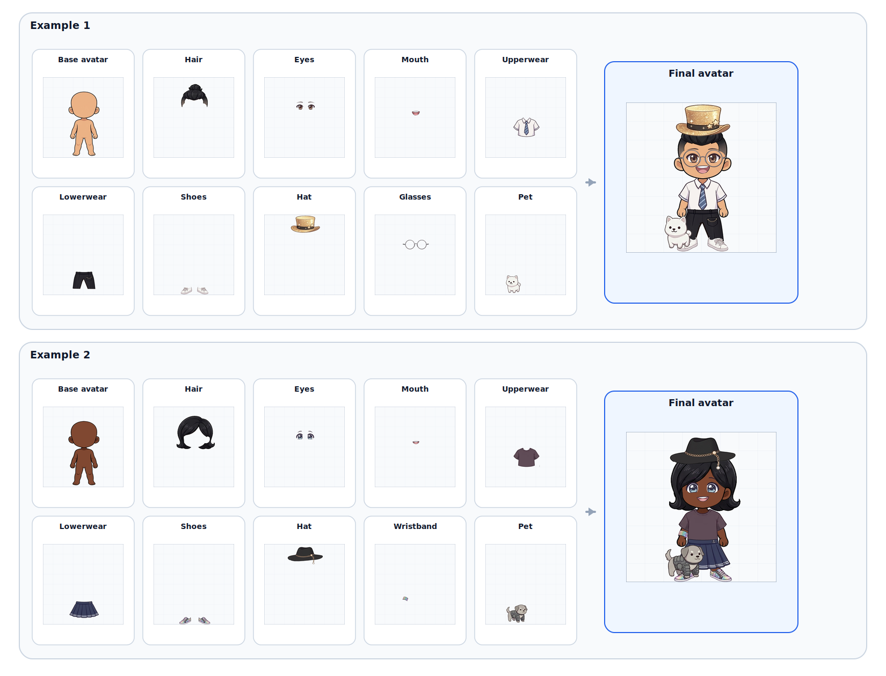

_Avatar asset layering examples using shared blueprint assets._

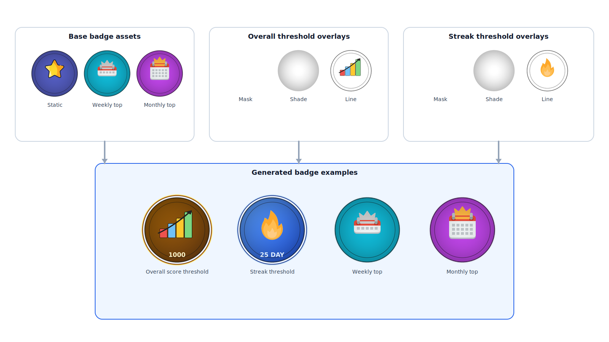

_Badge asset layering examples using reusable base and overlay assets._

### 3.5.6 Event Handling Map

Consumer:

- `services/game-service/src/events/quiz-events-consumer.ts`

Input streams:

- `quiz.attempt.v1`
- `class.lifecycle.v1`
- `class.canonical.v1`

Input stream semantics:

- `quiz.attempt.v1`
  - Immediate gameplay progression signal (points/reward triggers, attempt-derived deltas).
- `class.lifecycle.v1`
  - Class/roster/schedule context maintenance for leaderboard scope and projection ownership boundaries.
- `class.canonical.v1`
  - Authoritative canonical correction feed used to reconcile game projections when class truth changes.

Class lifecycle side-effects:

- `ClassCreated`
  - Seeds class state mirror, stats rows, default reward rules, score threshold config, badge config, and student inventories.
- `ClassDeleted`
  - Cascades deletion across class state, stats, attempts mirror, inventories, rules, grants, notifications, and badge period awards.
- `ScheduleUpdated`
  - Updates mirrored schedule contribution and triggers reweighting via `game_onScheduleContributionChanged`.
- `StudentAddedToClass` / `StudentRemovedFromClass`
  - Creates/removes student projection and inventory state for that class.

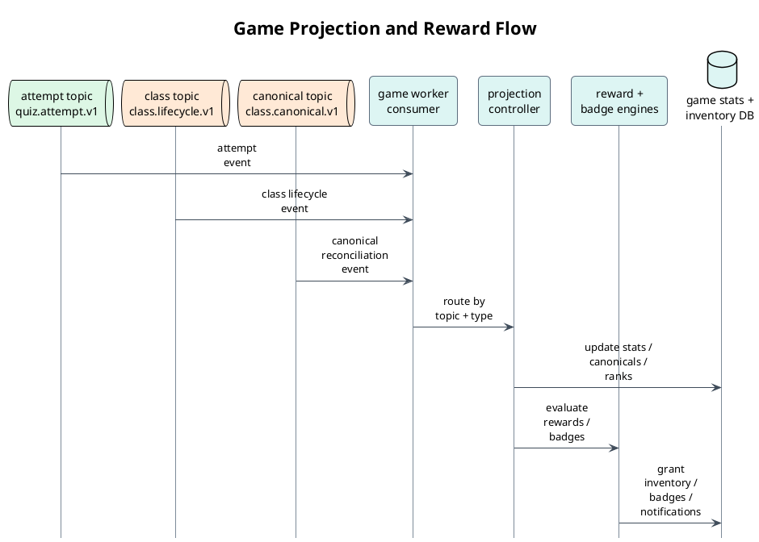
```plantuml
@startuml
title Game Projection and Reward Flow
!theme plain
skinparam backgroundColor #FFFFFF
skinparam defaultFontName Cabin
skinparam shadowing false
skinparam roundCorner 10
skinparam sequenceMessageAlign center
skinparam ArrowColor #3F4C5A
skinparam SequenceLifeLineBorderColor #7D8B99
skinparam SequenceLifeLineBackgroundColor #F6F8FB
skinparam ParticipantBorderColor #5D6D7E
skinparam ParticipantBackgroundColor #EAF1FB
skinparam wrapWidth 160
skinparam maxMessageSize 90
skinparam ParticipantPadding 8
skinparam BoxPadding 6
skinparam Padding 4
skinparam ResponseMessageBelowArrow true
hide footbox

queue "attempt topic\nquiz.attempt.v1" as AttemptTopic #DDF7E5
queue "class topic\nclass.lifecycle.v1" as ClassTopic #FFE9D6
queue "canonical topic\nclass.canonical.v1" as CanonicalTopic #FFE9D6
participant "game worker\nconsumer" as Consumer #DDF5F3
participant "projection\ncontroller" as Projection #DDF5F3
participant "reward +\nbadge engines" as Rewards #DDF5F3
database "game stats +\ninventory DB" as GameDB #DDF5F3

AttemptTopic -> Consumer: attempt\nevent
ClassTopic -> Consumer: class lifecycle\nevent
CanonicalTopic -> Consumer: canonical\nreconciliation event
Consumer -> Projection: route by\ntopic + type
Projection -> GameDB: update stats /\ncanonicals / ranks
Projection -> Rewards: evaluate rewards /\nbadges
Rewards -> GameDB: grant inventory /\nbadges / notifications
@enduml
```

---

# 4. Web App

## 4.1 Framework and Routing

Framework:

- Next.js App Router (`web-app/app`)

Page structure:

- Route files in `app/(app)` and `app/(landing)`
- Shared layouts and providers in `app/layout.tsx` and `app/providers.tsx`

## 4.2 Service Specific Actions

Actions specific to each service are groupped in service-specific folders under `web-app/services`:

- `web-app/services/class/actions`
- `web-app/services/quiz/actions`
- `web-app/services/user/*`
- `web-app/services/game/actions`
- `web-app/services/ai-generation`

Patterns used:

- `"use server"` actions for fetches
- Centralized auth header retrieval via session helpers (`iron session` library)

### 4.2.1 Session/JWT Handling Specifics

- Session store implementation:
  - `web-app/services/user/session-definitions.ts`
  - Main auth cookie: `main-session` (iron-session, httpOnly).
  - Session shape includes:
    - Identity: `userId`, `username`, `email`, `name`, `honorific`
    - Auth state: `isLoggedIn`, `isAdmin`
    - Credential: `accessToken` (JWT from User Service).
- Login/session creation path:
  - `services/user/sign-in-actions.ts`
  - On successful `/teacher/auth/sign-in`, the server action writes the returned JWT into `session.accessToken`, sets identity flags, then `session.save()`.
- Sign-up verification auto-login path:
  - `services/user/sign-up-actions.ts`
  - After `/teacher/auth/verify-email` succeeds, the same session fields are written so verified users enter the app immediately.
- Logout path:
  - `services/user/sign-in-actions.ts` (`signOutAction`)
  - `session.destroy()` clears auth session and route access.
- Route guard behaviour:
  - `app/(app)/layout.tsx` checks `session.isLoggedIn` and redirects unauthenticated users to `/auth/sign-in`.
  - `app/(landing)/layout.tsx` redirects authenticated users away from public auth pages to `/home`.
- Auth header propagation pattern:
  - `getAuthHeader()` returns `Bearer <session.accessToken>` from server-side session.
  - Service actions (`services/class/actions/*`, `services/quiz/actions/*`, `services/game/actions/*`, `services/ai-generation/*`) call this helper and forward `Authorization` headers to backend services.
- Session refresh after profile mutations:
  - `services/user/edit-user-actions.ts` updates session identity fields after successful profile changes so UI state remains consistent with authoritative backend values.

## 4.3 Component Modularity

Large feature areas are split into domain component trees:

- Classes:
  - `components/classes/...`
- Quizzes:
  - `components/quizzes/...`
- Navigation:
  - `components/navigation/...`
- Shared UI:
  - `components/ui/...`
- Scheduling workspace:
  - `components/scheduling/...`

This keeps page routes thin and focused on data orchestration, specific UI design and interaction logic is encapsulated in the sub components.

## 4.4 Data Fetching Style

The current implementation intentionally uses server side fetching:

- Page-level initial fetch is performed server-side
- Interactive filters and mutations use server actions
- Most API calls are never made directly from browser client code

This consistent server-side data handling pattern simplifies auth header management and keeps the client surface free of direct API calls, which simplifies mental model for data flow and management in the app.

## 4.5 Reusable Component Architecture

The web app uses a layered component model:

1. Top level App Shell

- `components/navigation/AppShell.tsx`
- `components/navigation/SideBar.tsx`
- `components/navigation/TopBar.tsx`

`AppShell` consists of persistent layout structure (sidebar + topbar + scrollable main panel) and responsive sidebar collapse behaviour. All app routes inherit the same navigation components.

2. UI primitives

These are resuable components with a consistent design language used across the app for common UI patterns:

- Buttons: `components/ui/buttons/*`
- Inputs/selectors: `components/ui/text-inputs/*`, `components/ui/selectors/*`
- Table and pagination system: `components/table/*`
- Modal and feedback system: `components/ui/WarningModal.tsx`, `components/ui/toast/ToastProvider`

3. Domain-level components

- Quizzes: `components/quizzes/*`
- Classes: `components/classes/*`
- Scheduling: `components/classes/schedule-page/*`
- Dashboard: `components/dashboard/*`

**Example of the shared shell structure**

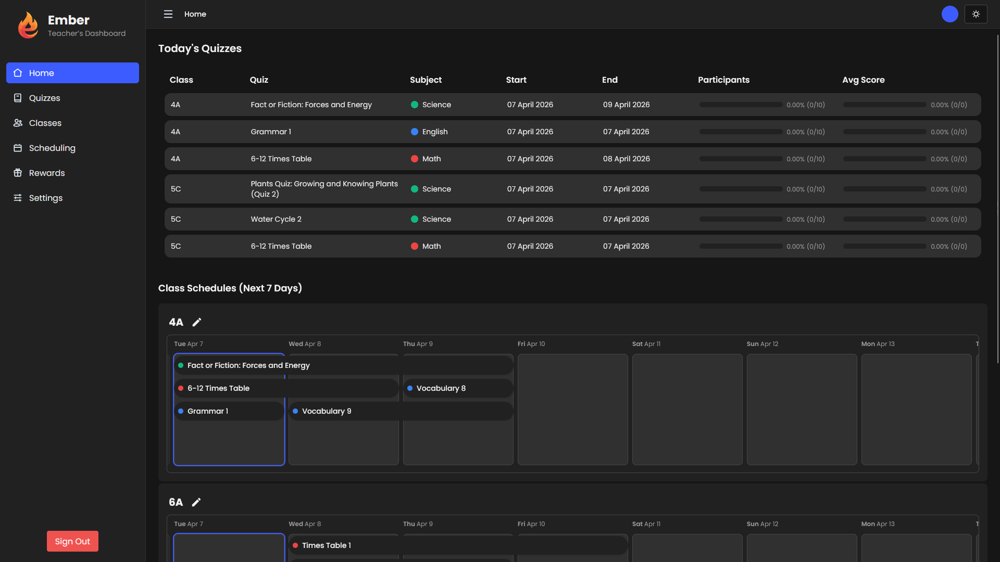

The home/dashboard view is useful as a structural reference: left navigation, top utility bar, and the central route content region that is dynamic based on tab routing.

## 4.6 Theming and Tailwind + CSS Variable System

Core theme assets:

- Global tokens: `web-app/app/globals.css`
  - Defines all colours used across all app modules. (Applied using tailwind)
- App providers: `web-app/app/providers.tsx`
  - Mounts theme/session/context providers used by all routed pages.

Implementation details:

1. Tailwind v4 + CSS variables

- `@import "tailwindcss";` with `@theme` token definitions in `globals.css`.
- Colour variables are used across the app:
  - Primary: `--color-primary`, `--color-primary-light`, `--color-primary-dark`
  - Text: `--color-text-primary|secondary|tertiary`
  - Surfaces: `--color-bg1|bg2|bg3|bg4`
  - Feedback: `--color-error|success|warning`

2. Light/dark mode strategy

- `:root` defines light defaults.
- `[data-theme=\"dark\"]` overrides colour for dark mode.
- `next-themes` provider in `app/providers.tsx` controls `data-theme` on `<html>`.

3. Styling pattern

- Components use classes like `text-[var(--color-text-primary)]` and `bg-[var(--color-bg2)]` with tailwind to apply theme colours.
- Removes the use of harded colour values and keeps the theme of the app consistent and easily adjustable from the global css file.

## 4.7 Quizzes Tab Architecture

Entry route:

- `web-app/app/(app)/quizzes/page.tsx`

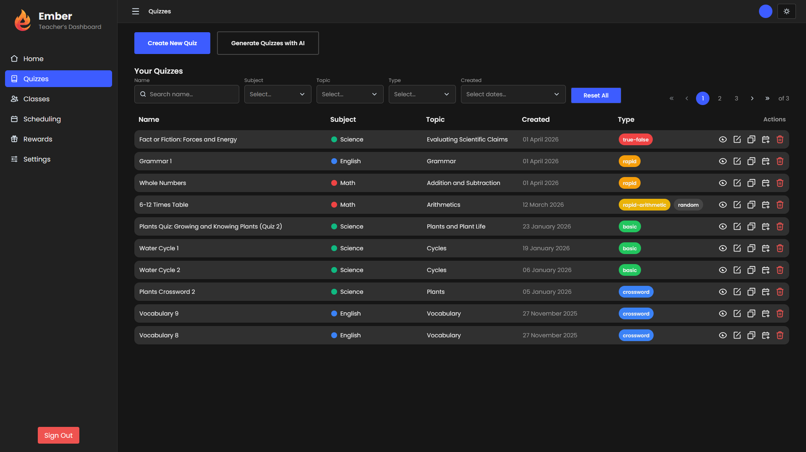

### 4.7.1 Request-to-UI Flow

1. Server route (`/quizzes`) calls `getFilterMeta()` and `queryQuizzes()` before first paint.
2. Page passes initial rows + filter metadata into `QuizzesTable`.
3. `QuizzesTable` configures `DataTable` with quiz-specific actions and row mapping.
4. `DataTable` runs all ongoing table state transitions (filter, search, pagination, delete confirmation).
5. Row actions route into specialized screens (create/edit/view/schedule/AI generation), instead of embedding all behavior in the table.

### 4.7.2 Quizzes List Component Breakdown (`/quizzes`)

Core components:

- `web-app/components/quizzes/QuizzesTable.tsx`
  - Quiz-domain adapter over generic table primitives
  - Binds domain actions: view/edit, duplicate by type, delete, schedule modal open, drag payload config
- `web-app/components/table/DataTable.tsx`
  - State coordinator for query/filter/search/pagination/delete confirmation
  - Hook layer: `usePagedQuery`, `useTableFilters`, `useDebounced`
- `web-app/components/table/CardTable.tsx`
  - Table grid shell and row iteration
- `web-app/components/table/TableRowCard.tsx`
  - Row interaction surface (click, keyboard, drag, row actions)

Cell contract:

- `web-app/services/quiz/types/quiz-table-types.ts`
- Supported variants:
  - `NormalCell`
  - `LabelCell`
  - `TagsCell`
  - `ProgressBarCell`
  - `DateCell`
  - `AvatarCell`

This contract is what allows one table engine to serve quizzes, classes, students, scheduling, and results with consistent behavior.

### 4.7.3 DataTable Decomposition

`DataTable` should be read as three layers:

1. State and fetch layer

- Determines query params and fetch cadence
- Exposes a normalized row set and pagination state

2. Composition layer

- Renders filters, card table, pagination, and warning modal in a fixed layout
- Does not decide quiz-specific domain rules

3. Row/cell rendering layer

- `CardTable` + `TableRowCard` map row data into typed cells
- Cell variant components render the final visual primitive

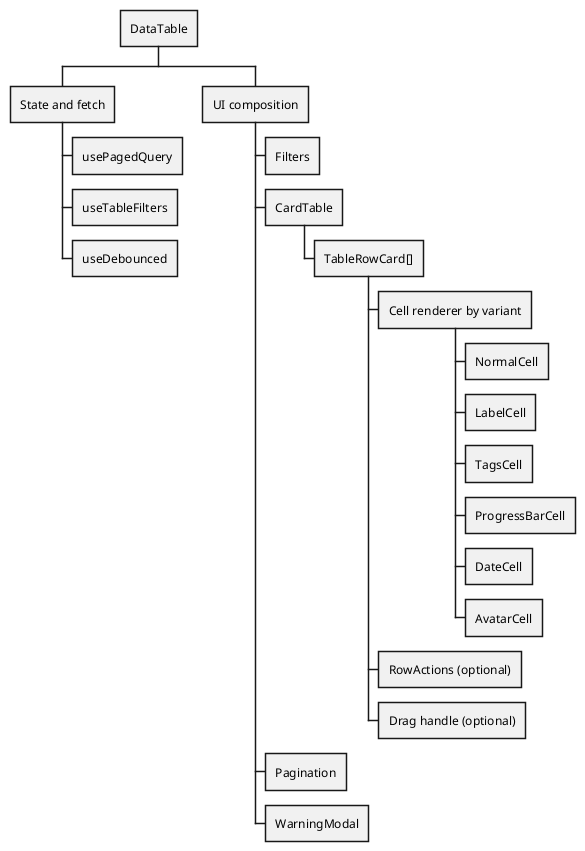
```plantuml
@startwbs
* DataTable
** State and fetch
*** usePagedQuery
*** useTableFilters
*** useDebounced
** UI composition
*** Filters
*** CardTable
**** TableRowCard[]
***** Cell renderer by variant
****** NormalCell
****** LabelCell
****** TagsCell
****** ProgressBarCell
****** DateCell
****** AvatarCell
***** RowActions (optional)
***** Drag handle (optional)
*** Pagination
*** WarningModal
@endwbs
```

### 4.7.4 Quiz Creation/Editing Forms

The quizzes tab is only the control surface. Each major action (create/edit/view/schedule/AI generation) routes into a dedicated screen with its own component tree and data orchestration logic.

#### Basic create/edit page (`/quizzes/create/quiz-basic`, `/quizzes/edit/[id]`)

- `BasicQuizForm` is the main authoring surface.
- Shared blocks: `MetaFields`, `TimerField`, `TypeTabs`, `VersionSelector`, `QuizVersionModal`.
- This screen handles standard question authoring and grading options.

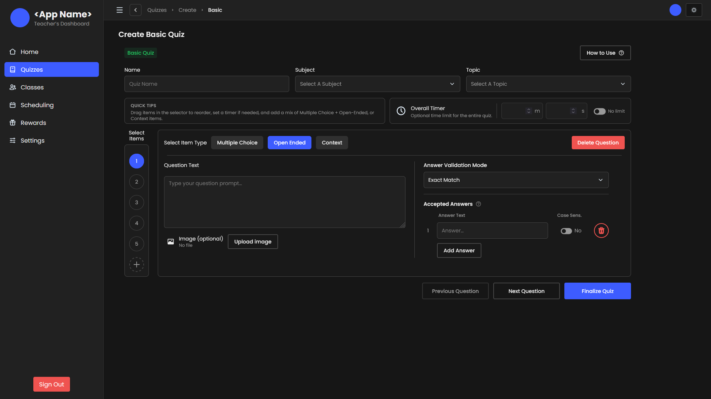

#### Rapid create/edit page (`/quizzes/create/quiz-rapid`, `/quizzes/edit/[id]`)

- `RapidQuizForm` is the rapid quiz authoring surface.
- Shares the same metadata/version helpers as the basic form.
- Focuses on rapid-specific settings and multiple-choice structure.

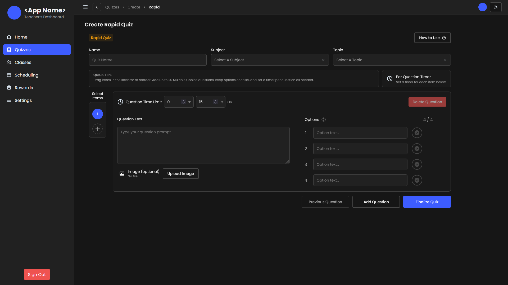

#### Rapid Arithmetic create/edit page (`/quizzes/create/quiz-rapid-arithmetic`, `/quizzes/edit/[id]`)

- `RapidArithmeticQuizForm` is the arithmetic-generation authoring surface.
- Includes arithmetic-specific generation controls while reusing shared helper blocks.

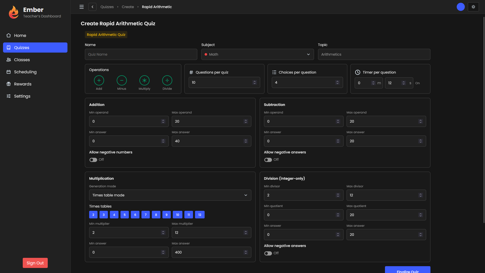

#### Crossword create/edit page (`/quizzes/create/quiz-crossword`, `/quizzes/edit/[id]`)

- `CrosswordQuizForm` handles crossword payload authoring and clue/entry structure.
- Reuses shared metadata/version controls from helper components.

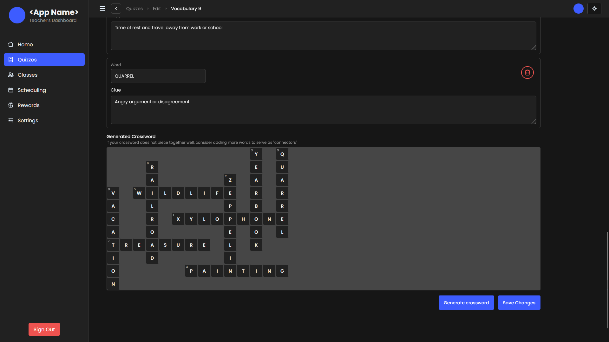

#### Crossword Bank create/edit page (`/quizzes/create/quiz-crossword-bank`, `/quizzes/edit/[id]`)

- `CrosswordBankQuizForm` handles bank-driven crossword generation inputs.
- Reuses shared metadata/version blocks while exposing bank-specific fields.

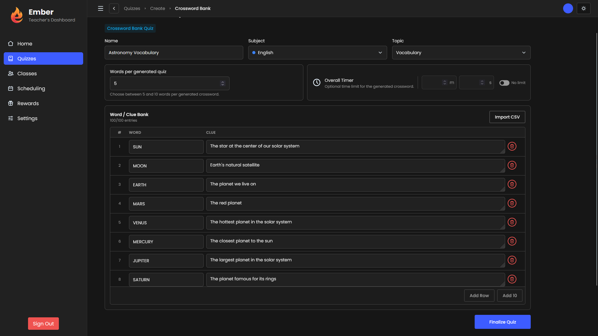

#### True/False create/edit page (`/quizzes/create/quiz-true-false`, `/quizzes/edit/[id]`)

- `TrueFalseQuizForm` is the true/false authoring surface.
- Keeps the same shared metadata/version model and simpler item authoring flow.

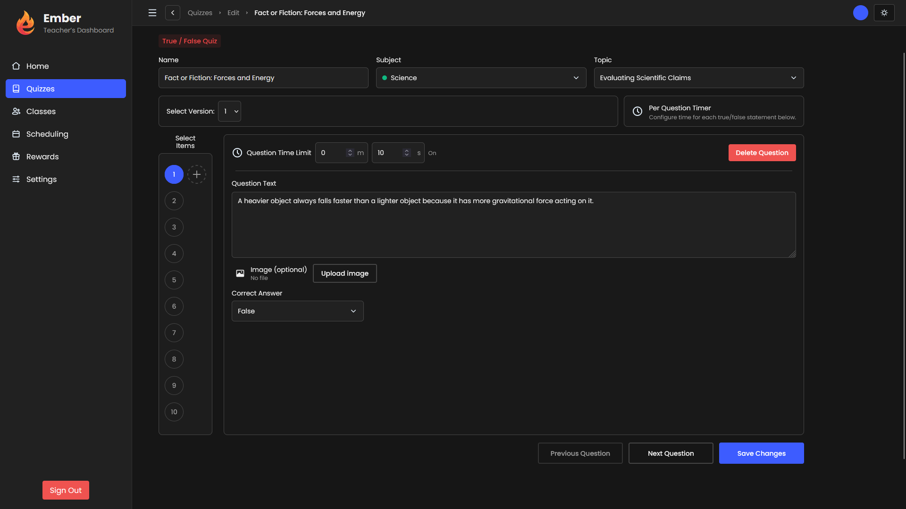

#### Shared Form Hooks, Action Linkage, and Error Handling (All Quiz Types)

The create/edit pages share the same execution pattern, even though each quiz type has different payload fields.

**1. Server action wiring and submission lifecycle**

- All form variants use `useActionState(processQuiz, initialState)` and submit through a `<form action={formAction}>` pipeline.
- The `processQuiz` server action (`web-app/services/quiz/actions/process-quiz-action.ts`) is the singular action that processes all form submissions
- Each form also wraps submissions with `handleSubmitGuard` to enforce client-side preconditions before allowing action execution (for example: at least one item exists, generated crossword state is valid, arithmetic settings are coherent).

**2. Shared form-state hooks and local draft state**

- Quiz forms centralize common behaviors through `useFormUtils` (`web-app/services/quiz/quiz-form-helpers/hooks/useFormUtils`):
  - Top-level field error access (`getVisibleFieldError`)
  - Per-item error indexing and row mapping
  - Clear-on-edit behavior for stale error messages
  - Helpers for touched/dirty semantics used by unsaved-change prompts.
- `useState` is used for local draft state per type:
  - Item arrays (`questions`, `entries`, `true/false items`)
  - Selector state (`currentIndex`, `selectorVertical`)
  - Type-specific controls (for example operators and bounds in rapid arithmetic).
- `useEffect` keeps derived values synchronized (for example total time summaries, responsive selector layout, and state reset when item collections change).

**3. Reusable form component blocks**

- Shared building blocks are reused across all type forms:
  - `MetaFields` for name/subject/topic and option lists
  - `TimerField` for duration controls
  - `QuestionSelector` for indexed navigation/add/remove/reorder
  - `VersionSelector` + `QuizVersionModal` for version-aware editing and branching.
- Type-specific editors plug into the same skeleton:
  - Basic/rapid item editors
  - Crossword entry editors (`CrosswordAnswerEditor`, `CrosswordEntryRow`)
  - Arithmetic configuration controls
  - True/false statement editors.
- Because the outer skeleton is stable, adding a new type mostly means implementing new payload editor components and mapping them into the shared validation+submit contract.

**4. Error handling model (field, row, and global)**

- Error reporting is layered:
  - Field-level errors shown near input controls (`MetaFields`, timer and scalar controls)
  - Row-level errors shown inside item/entry editors
  - Global banners and toast notifications for cross-field or server-level failures.
- Server action responses carry normalized error payloads. Forms map these into:
  - Top-field error getters
  - Per-index error collections (highlighted by `QuestionSelector`)
  - Fallback/global messages when mapping is partial.
- Every form clears relevant errors immediately on user correction to avoid stale “stuck” error UI.
- Network errors and unexpected response shapes are normalized in action code to stable user-facing messages, so the UI does not expose raw backend exceptions.

**5. Mutation safety and unsaved-change protections**

- Destructive operations (delete row/item, version changes) are guarded by modal confirmations.
- Forms track content mutation state (`contentChanged`) and block unsafe navigation or version switches until confirmed.
- Pending flags from `useActionState` are used to disable submit actions and prevent duplicate submissions.
- Toast feedback (`useToast`) is standardized to success/error variants and shown on state transitions after mutation completion.

**6. Crossword specific form**

- Crossword forms add a secondary generation state machine (`genLoading`, `genGrid`, `genEntries`, `genFieldErrors`, `genQuestionErrors`) before final save.
- This enforces “generate candidate crossword” is successfully run before submission.
- AI-generated quizzes still end up in the same quiz-form save contract (`processQuiz`) during approval/edit finalization, preserving one mutation pathway.

### 4.7.5 AI Generation Screens in the Quizzes Module

This UI is implemented around AI generation being asyncronous jobs with multiple stages.

#### Wizard stage

- `GenerationWizard` (`web-app/components/quizzes/ai-generation/GenerationWizard.tsx`)
  - Owns user intent fields (level, subject/topic, quiz type target, question count and constraints)
  - Validates required inputs before job creation
  - Submits generation request and route transition into processing state
- `FileUploadZone` (`web-app/components/quizzes/ai-generation/components/FileUploadZone.tsx`)
  - Handles source document upload list and file lifecycle in the wizard
  - Forwards uploaded assets into generation request context
- `DocumentTypeSelectionModal` (`web-app/components/quizzes/ai-generation/components/DocumentTypeSelectionModal.tsx`)
  - Enforces document-type tagging before the file is committed into prompt context
  - Prevents untyped sources from polluting downstream extraction/parsing logic
- `JobsSidebar` (`web-app/components/quizzes/ai-generation/JobsSidebar.tsx`)
  - Left navigation for recent and in-progress jobs
  - Keeps job switching independent from current panel state

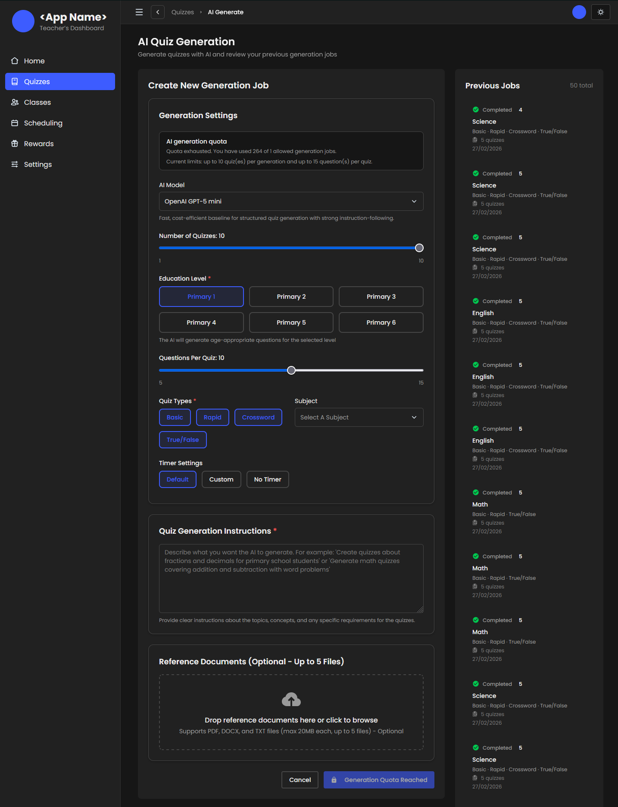

#### Processing stage

- `JobCard` (`web-app/components/quizzes/ai-generation/components/JobCard.tsx`)
  - Compact status surface for a single job (queued/running/completed/failed)
  - Exposes job metadata needed for auditability and resume
- `ProcessingState` (`web-app/components/quizzes/ai-generation/components/ProcessingState.tsx`)
  - Loading-state UI while backend extraction + generation runs
  - Blocks review actions until normalized quiz drafts are ready

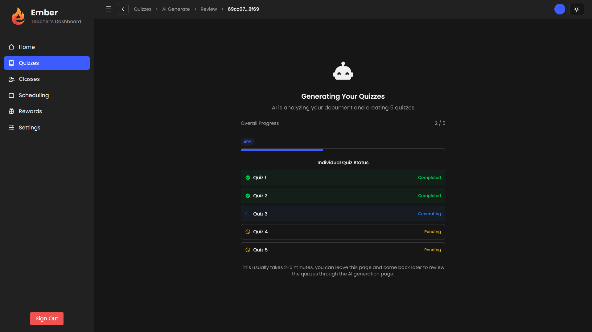

#### Review stage

- `GeneratedQuizReview` (`web-app/components/quizzes/ai-generation/GeneratedQuizReview.tsx`)
  - Orchestrates draft list rendering, per-draft expansion, and approval actions
  - Separates accept/discard from edit flows so draft state changes are explicit
- `QuizListItem` (`web-app/components/quizzes/ai-generation/components/QuizListItem.tsx`)
  - Per-generated-quiz row surface (summary, type, quick actions)
  - Acts as entry point into detailed edit/review operations
- Accepted drafts are promoted into normal quiz lifecycle modules (`view`, `edit`, `schedule`), so no duplicate post-approval path is introduced

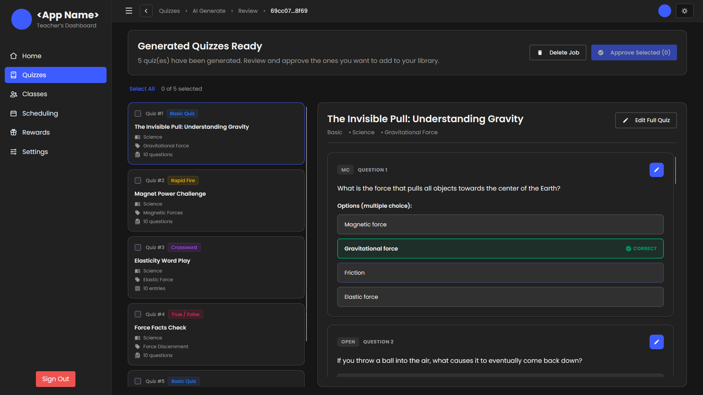

### 4.7.6 Quizzes Module Component Tree

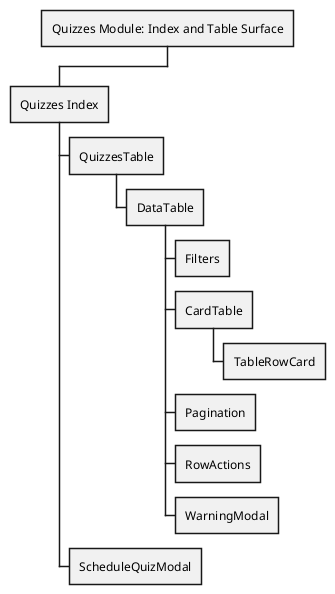
```plantuml
@startwbs
* Quizzes Module: Index and Table Surface
** Quizzes Index
*** QuizzesTable
**** DataTable
***** Filters
***** CardTable
****** TableRowCard
***** Pagination
***** RowActions
***** WarningModal
*** ScheduleQuizModal
@endwbs
```

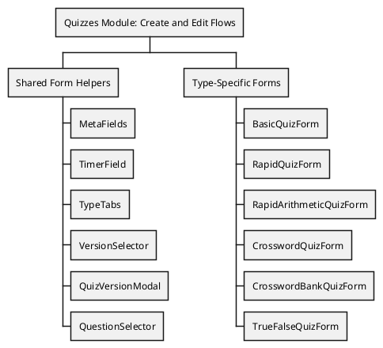
```plantuml
@startwbs
* Quizzes Module: Create and Edit Flows
** Shared Form Helpers
*** MetaFields
*** TimerField
*** TypeTabs
*** VersionSelector
*** QuizVersionModal
*** QuestionSelector
** Type-Specific Forms
*** BasicQuizForm
*** RapidQuizForm
*** RapidArithmeticQuizForm
*** CrosswordQuizForm
*** CrosswordBankQuizForm
*** TrueFalseQuizForm
@endwbs
```

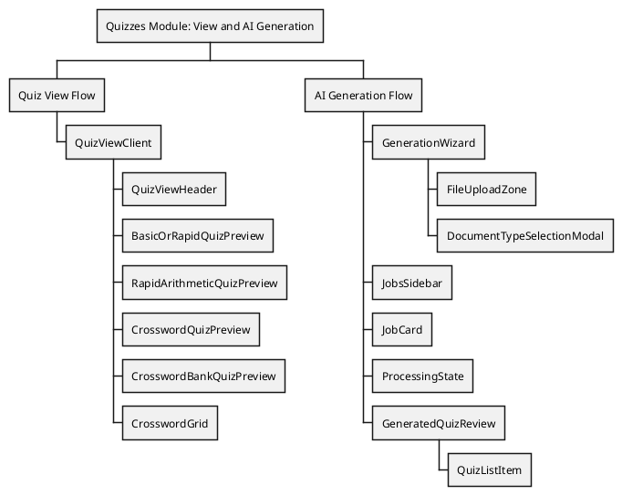
```plantuml
@startwbs
* Quizzes Module: View and AI Generation
** Quiz View Flow
*** QuizViewClient
**** QuizViewHeader
**** BasicOrRapidQuizPreview
**** RapidArithmeticQuizPreview
**** CrosswordQuizPreview
**** CrosswordBankQuizPreview
**** CrosswordGrid
** AI Generation Flow
*** GenerationWizard
**** FileUploadZone
**** DocumentTypeSelectionModal
*** JobsSidebar
*** JobCard
*** ProcessingState
*** GeneratedQuizReview
**** QuizListItem
@endwbs
```

## 4.8 Classes Tab Architecture

Entry page:

- `web-app/app/(app)/classes/page.tsx`

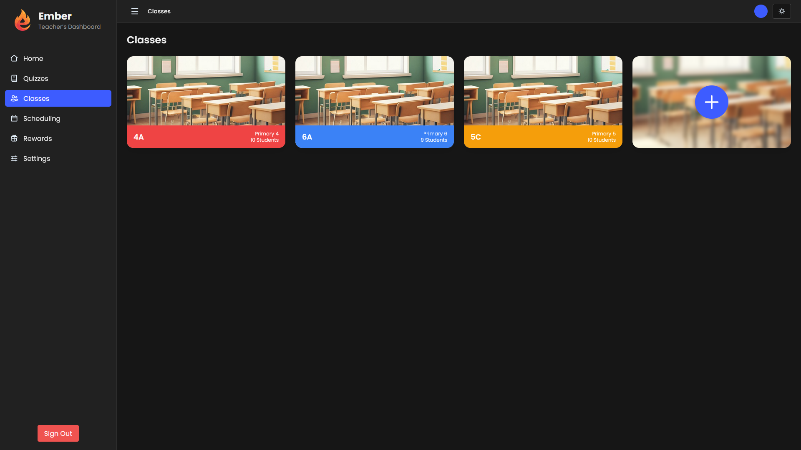

### 4.8.1 Class Index Tab (`/classes`)

- `web-app/app/(app)/classes/page.tsx`
  - Lists class cards
  - Each card routes to class details

- `ClassGrid`
  - Responsive grid container (`sm` to `xl` breakpoints)
  - Maps fetched class records to `ClassCard`
  - Appends `AddClassCard` as a fixed final tile
- `ClassCard`
  - Card-level route link to `/classes/[id]`
  - Cover image + metadata footer strip
  - Visual encoding for class color and student count

### 4.8.4 Class Creation Tab (`/classes/create`)

- `web-app/app/(app)/classes/create/page.tsx`
  - Uses class form components (`CreateClassForm`, `ClassFields`)
  - Supports class image, level, color, timezone, and roster onboarding

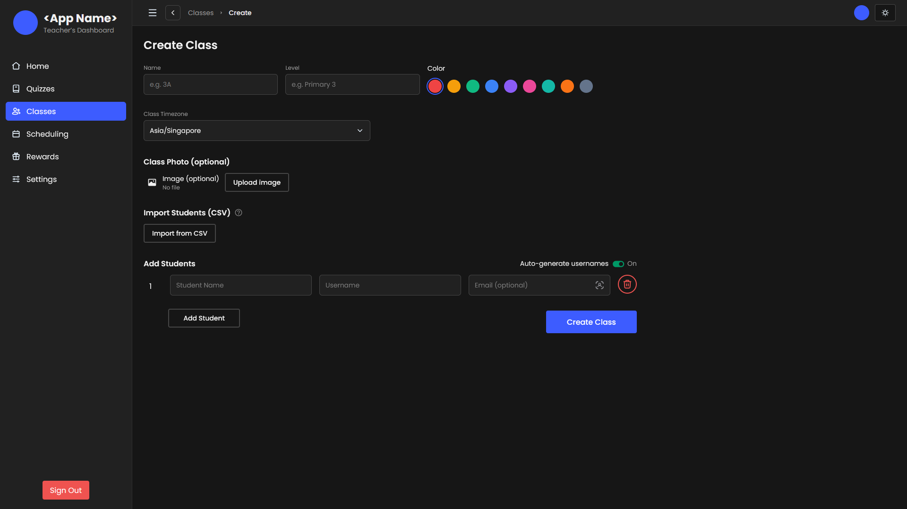

- `CreateClassForm`
  - Orchestrates the entire class creation workflow
  - Binds server action `processClass` via `useActionState`
  - Owns local student draft rows and import state
- `ClassFields`
  - Class identity fields (name, level, color, timezone)
  - Keeps global form structure consistent with edit flow
- `StudentCsvProcessor`
  - Parses teacher-uploaded CSV and emits normalized `StudentDraft[]`
  - Supports “import then refine manually” workflow
- `IssuedCredentialsPanel`
  - Post-submit success state
  - Shows generated student credentials immediately after class creation
- `ImageUpload` + `uploadClassImage`
  - Class cover asset upload before final submit

### 4.8.5 Overview Tab (`/classes/[id]/overview`)

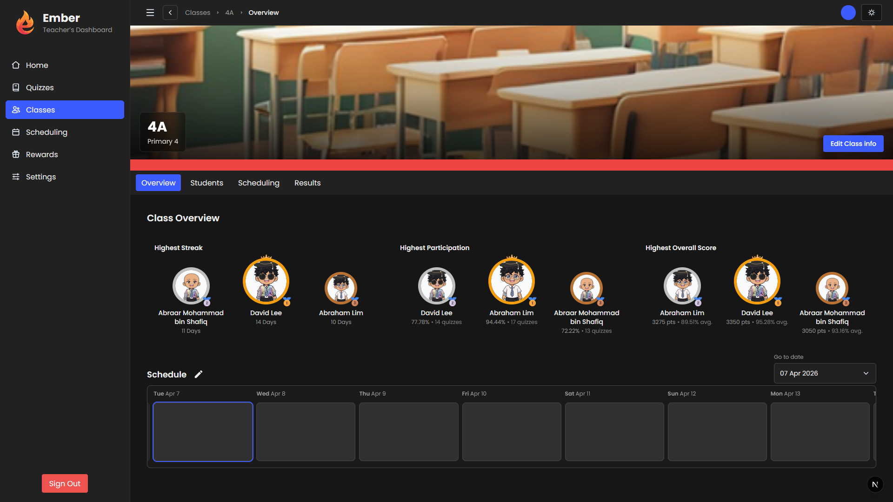

- Route: `web-app/app/(app)/classes/[id]/overview/page.tsx`
- Server data aggregation:
  - `getClass(classId)` for timezone and metadata
  - `getClassSchedule(classId)` for schedule timeline
  - `getTopStudentsAction(classId, { limit: 3 })` for podiums
- Rendered modules:
  - `TopLeaders`: top overall score, participation, and streak
  - `OverviewScheduleClient`: read-only 7-day calendar using class timezone
  - Schedule rendering reuses the same calendar primitives as the scheduling tab, but with `readOnly` mode

- `TopLeaders`
  - Maps backend podium arrays into three fixed podium cards
  - Renders independent leaderboards for streak, participation, and overall score
- `OverviewScheduleClient`
  - Converts server-fetched schedule data into data prop for `SevenDayCalendar`
  - Reuses scheduling calendar (`SevenDayCalendar`) in read-only mode

### 4.8.6 Students Tab (`/classes/[id]/students`)

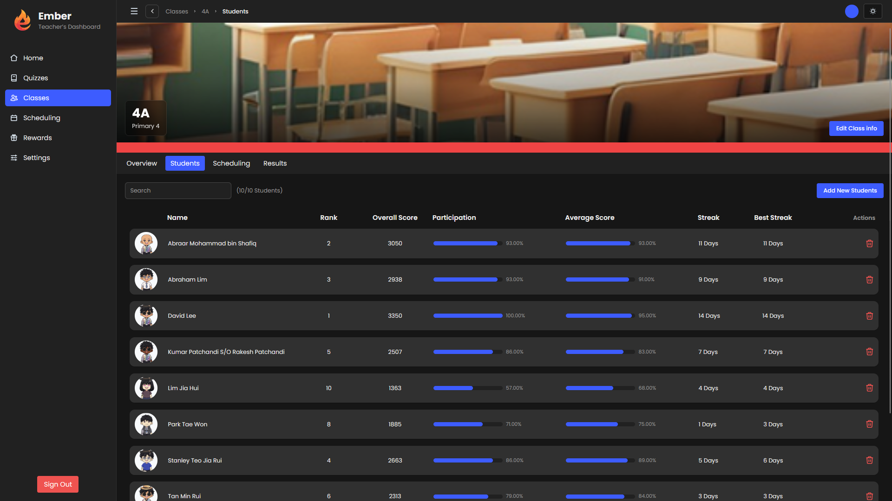

- Route: `web-app/app/(app)/classes/[id]/students/page.tsx`
- Server side:
  - `getClassStudents(classId)` fetches full class roster + projections
  - Rows are pre-shaped into `CardTable` cells server-side (avatar, rank, participation bar, average score bar, streak metrics)
- Client side (`StudentsTable.tsx`):
  - In-memory search filter (no roundtrip for search)
  - Row click navigation to `/students/[studentId]`
  - Remove-student flow with warning modal + `removeStudentAction`
  - Add-student entry action to `/students/add`

- `StudentsTable`
  - Local query filtering over server-provided row payload
  - Table rendering via `CardTable` (no pagination for now since class sizes are expected to be manageable, hence no `DataTable` layer)
  - Delete actions are gated with `WarningModal`
- Table row model
  - Avatar, rank, overall score, participation, avg score, streak and best streak
  - All modeled as typed cell variants so rendering stays generic

### 4.8.7 Student Detail Page (`/classes/[id]/students/[studentId]`)

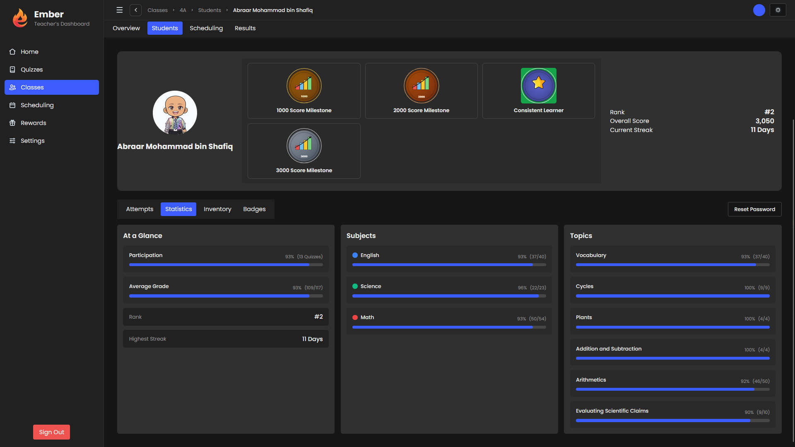

- Route: `web-app/app/(app)/classes/[id]/students/[studentId]/page.tsx`
- This page is a second-level analytics/workflow hub for one student.
- Key server calls:
  - `getStudentInClass` (identity + rank + projection summary)
  - `getStudentScheduleSummary` (one row per schedule with canonical/latest attempt pointers)
  - Game reads: rewards catalog, inventory, owned badges
- Key UI switcher:
  - `StudentProfileSwitcher` with tabs:
    - `Attempts`: schedule-level attempt table, row opens attempt detail route
    - `Statistics`: student progress bars and aggregate metrics
    - `Inventory`: owned/equipped cosmetics with server actions
    - `Badges`: badge ownership/display controls
- Teacher operator controls:
  - `ResetStudentPasswordButton` available from this page

- `StudentProfileHeader`
  - Identity card with avatar, score, rank, streak, and badge cues
- `StudentProfileSwitcher`
  - Local tab switcher for Attempts / Statistics / Inventory / Badges
  - Keeps all student sub-views under one stable route
- `StudentAttemptsClient`
  - Schedule summary table
  - Click-through routing to attempt-detail route
  - Canonical-attempt-first navigation policy
- `StudentStatsDisplay`
  - Aggregate bars for participation and grade
  - By-subject and by-topic breakdown bars from projection maps
- Inventory and badges panels
  - `CosmeticCatalogGallery` + `BadgeCatalogGallery`
  - Teacher-side inventory curation tied to Game Service actions

### 4.8.8 Attempt Detail Page (`/classes/[id]/students/[studentId]/attempt/[attemptId]`)

- Route: `web-app/app/(app)/classes/[id]/students/[studentId]/attempt/[attemptId]/page.tsx`
- This route validates ownership and class/schedule relation before rendering attempt content.
- Rendering is quiz-type aware:
  - `BasicOrRapidAttempt` for basic/rapid/true-false/rapid-arithmetic
  - `CrosswordAttempt` for crossword/crossword-bank
- `AttemptHeader` + switcher allows moving across attempts from the same schedule/student pair.
- This is the key debugging route for teacher-side answer-by-answer review.

- `AttemptHeader`
  - Attempt identity context (quiz, score, canonical badge)
  - In-schedule attempt switcher
- `BasicOrRapidAttempt`
  - Renders item cards with awarded/max score pills
  - Supports MC/open/context item blocks with grading-key-aware rendering
- `CrosswordAttempt`
  - Overlays student answers onto crossword grid snapshot
  - Computes cell correctness highlighting from breakdown metadata
  - Renders per-word clue/expected vs student answer cards

### 4.8.9 Scheduling Tab (`/classes/[id]/scheduling`)

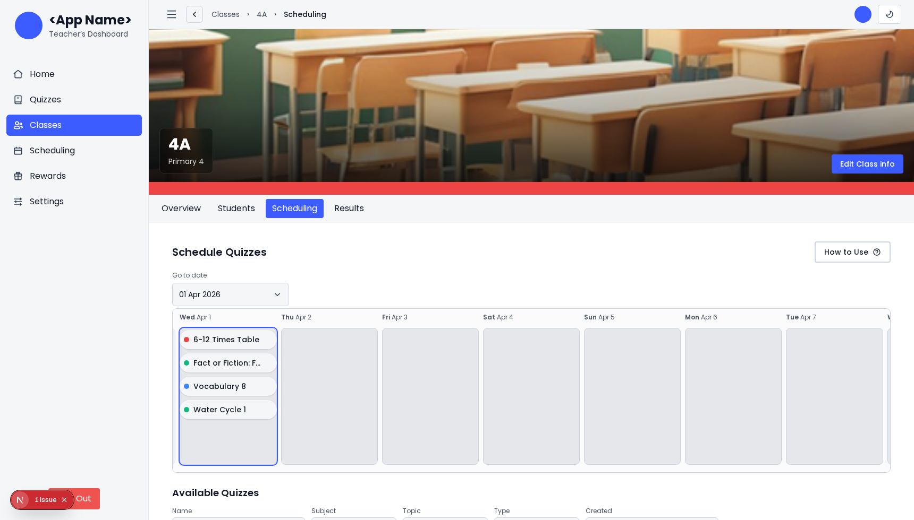

- Route: `web-app/app/(app)/classes/[id]/scheduling/page.tsx`
- Server bootstrap:
  - `getClassSchedule` for current schedule state
  - `getClass` for class timezone
  - `getFilterMeta` + `queryQuizzes` for left-panel quiz list
- Client orchestration (`SchedulerBoard.tsx`):
  - Drag/drop quiz rows onto calendar days to create schedule items
  - Resize pills to change windows
  - Edit/delete modals
  - Optimistic queues for create/edit/delete with rollback handling
  - Timezone-aware day-key and boundary logic

- `SchedulerBoard`
  - Root orchestrator for table + calendar + edit modal + drag overlays
  - Wires DnD events to scheduling mutations
  - Guards invalid operations (past scheduling, missing row payload fields)
- `QuizzesTable` (embedded)
  - Reused left panel for quiz discovery and dragging
  - Emits row drag payload with quiz metadata for scheduler creation
- `SevenDayCalendar`
  - Timeline viewport, day-window navigation, lane layout, and read/write rendering
- Scheduling calendar primitives:
  - `PillsGrid`, `SpanPill`, `DayDroppable`, `ScheduleItemHoverCard`, `ScheduleItemEditModal`
- Overlay/monitor components:
  - `PillOverlay`, `QuizRowOverlay`, `PillAnchorMonitor`, `PointerZoneMonitor`, `DragAutoSlideMonitor`
- Scheduling hooks:
  - `useDragState`: active drag, preview patches, resize refs
  - `useScheduleQueues`: queued create/edit/delete reconciliation and rollback snapshots
  - `useScheduleEditModal`: schedule patch form state + version options fetch

### 4.8.10 Results Tab and Schedule Breakdown

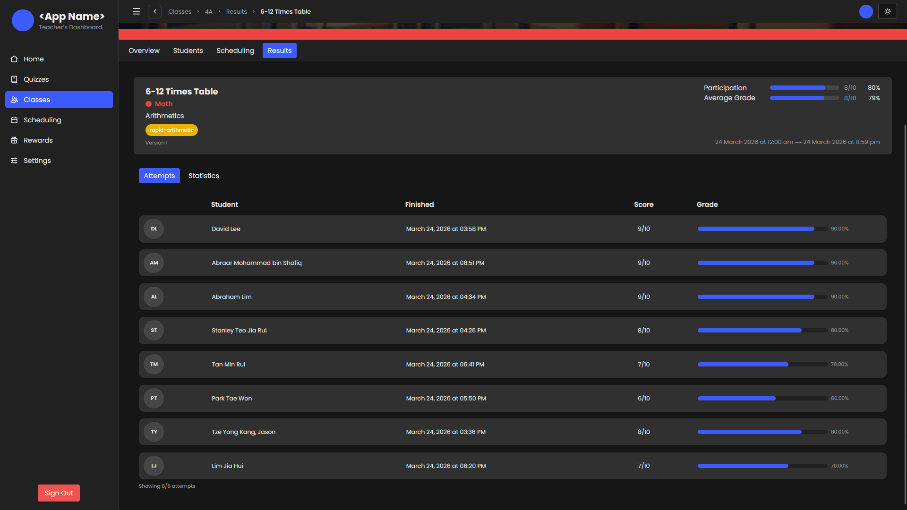

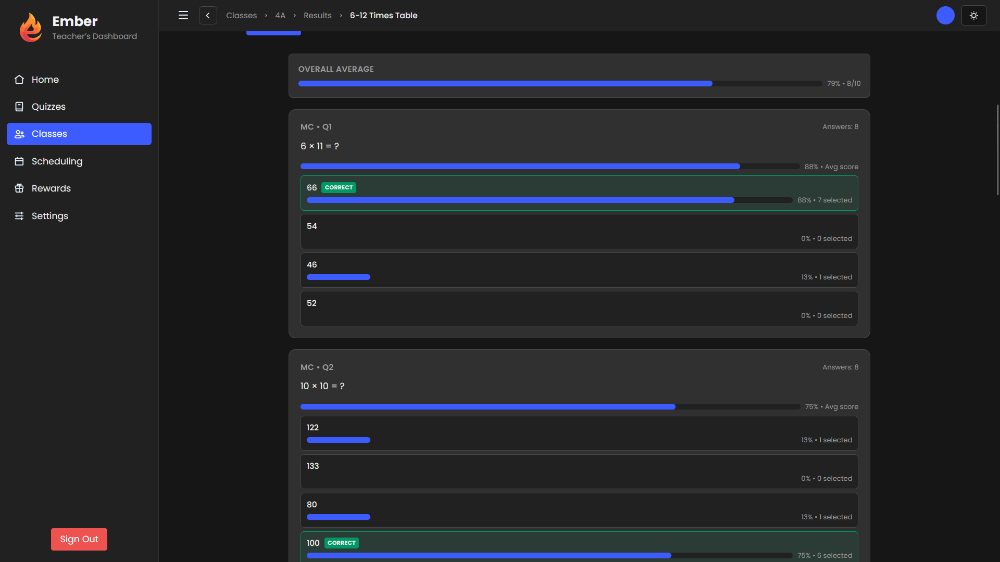

- List route: `web-app/app/(app)/classes/[id]/results/page.tsx`
  - `getAvailableScheduleWithStats` returns schedule-level aggregates
  - Each row shows participation and average score with progress bars
  - `ResultsTable` provides local search over quiz name/subject
  - Row click opens `/results/[scheduleId]`
- Drilldown route: `web-app/app/(app)/classes/[id]/results/[scheduleId]/page.tsx`
  - `getScheduleItemAction` returns canonical attempts + statistics breakdown
  - `ScheduleHeader` renders quiz identity and top KPIs
  - `ScheduleTabsClient` splits into:
    - `Attempts` tab: canonical attempts table; each row opens student attempt detail route
    - `Statistics` tab: per-question breakdown via `ScheduleStatsPanel`
      - `BasicRapidStats` for basic/rapid style questions
      - `CrosswordStats` for crossword style questions

- `ResultsTable` (list route)
  - Local search over quiz and subject fields
  - Table row click into schedule drilldown
- `ScheduleHeader` (drilldown route)
  - Quiz identity metadata + KPI bars (participation and average grade)
  - Date range rendered in class timezone
- `ScheduleTabsClient`
  - Route-local attempts/statistics tab split
  - Attempts tab row click deep-links into student attempt route
- `ScheduleStatsPanel`
  - Quiz-type switch for statistics renderer
  - Delegates to `BasicRapidStats` / `CrosswordStats` without leaking item-shape branching into page layer

### 4.8.11 Class Module Component Trees

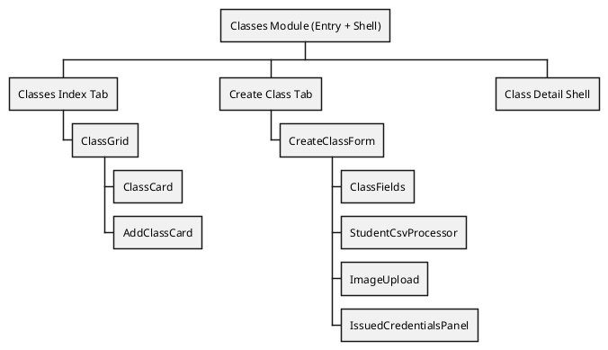
```plantuml
@startwbs
* Classes Module (Entry + Shell)
** Classes Index Tab
*** ClassGrid
**** ClassCard
**** AddClassCard
** Create Class Tab
*** CreateClassForm
**** ClassFields
**** StudentCsvProcessor
**** ImageUpload
**** IssuedCredentialsPanel
** Class Detail Shell
@endwbs
```

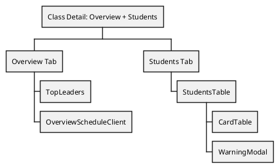
```plantuml
@startwbs
* Class Detail: Overview + Students
** Overview Tab
*** TopLeaders
*** OverviewScheduleClient
** Students Tab
*** StudentsTable
**** CardTable
**** WarningModal
@endwbs
```

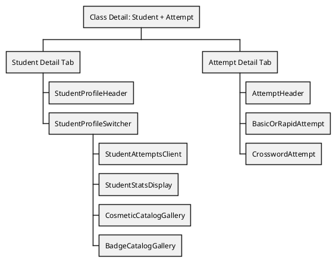
```plantuml
@startwbs
* Class Detail: Student + Attempt
** Student Detail Tab
*** StudentProfileHeader
*** StudentProfileSwitcher
**** StudentAttemptsClient
**** StudentStatsDisplay
**** CosmeticCatalogGallery
**** BadgeCatalogGallery
** Attempt Detail Tab
*** AttemptHeader
*** BasicOrRapidAttempt
*** CrosswordAttempt
@endwbs
```

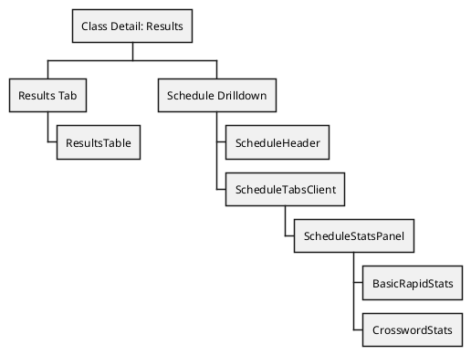
```plantuml
@startwbs
* Class Detail: Results
** Results Tab
*** ResultsTable
** Schedule Drilldown
*** ScheduleHeader
*** ScheduleTabsClient
**** ScheduleStatsPanel
***** BasicRapidStats
***** CrosswordStats
@endwbs
```

## 4.9 Scheduling Tab Architecture

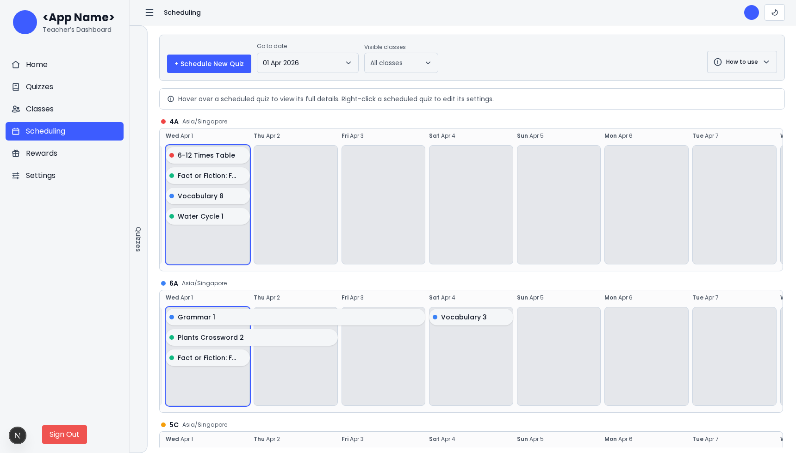

This is the top-level scheduling planner used to manage schedules across classes

### 4.9.1 Route Entry and Data Bootstrap

Route:

- `web-app/app/(app)/scheduling/page.tsx`

The global page preloads cross-class scheduling context before render:

- `getAllClassesScheduleForDashboard()` for schedule rows across classes
- `getClasses()` for class metadata (including colour and timezone)
- `getFilterMeta()` + `queryQuizzes()` for the quiz list panel

The route then builds class bundles (class + timezone + colour + schedule) and passes them to `SchedulingWorkspace`.

### 4.9.2 Workspace Orchestration

Primary component:

- `web-app/components/scheduling/SchedulingWorkspace.tsx`

Responsibilities:

- Normalizes raw schedule payload into client-safe items (`withClientIds`)
- Manages global calendar start key
- Owns in-memory class bundle state
- Provides schedule patch/replace callbacks to workspace modules

Current active workspace module:

- `web-app/components/scheduling/workspace/SchedulingCalendarsTab.tsx`

### 4.9.3 Global Scheduling Interactions

`SchedulingCalendarsTab` is the main global planner surface. It handles:

- Class visibility filtering (`selectedClassIds`)
- Shared seven-day window navigation across visible classes
- Drag-and-drop schedule creation from quiz rows into class-day cells
- Drag/resize/edit/delete operations on existing schedule pills
- Optimistic mutation flows with rollback and validation feedback

Even though this is a global page, it reuses class-scheduler primitives (`SevenDayCalendar`, `ScheduleItemEditModal`, overlays/monitors) so behaviour stays consistent between global and class-level schedulers.

### 4.9.4 Component Composition

Main composition path:

- `SchedulingWorkspace`
  - `SchedulingCalendarsTab`
    - `SchedulingControlsBar` and `SchedulingHelpDropdown`
    - Quiz list panel (`QuizzesTable` drag source)
    - Calendar surface (`SevenDayCalendar`)
    - Edit/delete surfaces (`ScheduleItemEditModal`, `WarningModal`)
    - DnD overlays and monitors (`PillOverlay`, `QuizRowOverlay`, `DragAutoSlideMonitor`)

### 4.9.5 Mutation and Error Behaviour

Global planner mutations call class-service scheduling actions:

- `addClassQuizSchedule`
- `editClassScheduleItem`
- `deleteClassScheduleItemById`

Validation failures are mapped through scheduling helper formatters and surfaced through toasts/modals so failures are explicit and actionable.

# 5. Phone App

## 5.1 Main Architecture and Session Management

Framework and routing stack:

- Expo + Expo Router
- Route groups:
  - `phone-app/app/(unauth)` for non authenticated screens (`landing`, `login`, `change-password`)
  - `phone-app/app/(main)` for authenticated routes (attempt runtime, notifications, avatar, badges)
  - `phone-app/app/(main)/(tabs)` for tab routes (at bottom of screen) (`home`, `leaderboard`, `history`, `profile`, `settings`)

Root layout and auth bootstrap:

- `phone-app/app/_layout.tsx` loads fonts, theme/safe-area providers, and session bootstrap.
- `phone-app/app/index.tsx` redirects user using session auth state:
  - `auth` -> `(main)/(tabs)/home`
  - `mustChangePassword` -> `(unauth)/change-password`
  - `unauth` -> `(unauth)/landing`

Session Management:

- Source: `phone-app/src/auth/session.ts`
- `signIn()` persists JWT + student account context
- `bootstrap()` restores persisted identity on app launch
- `token()` is the single bearer-token source for all authenticated API wrappers
- `_layout.tsx` is used as a gate for app startup, all (main) routes are protected by session bootstrap and auth gating logic here.
- `session.ts` owns both identity and auth token. Other components/screens do not manage token state locally.
- All authenticated API modules (`src/api/authed.ts`) pull from `token()` at call time.

Landing and sign in pages:

<p>
  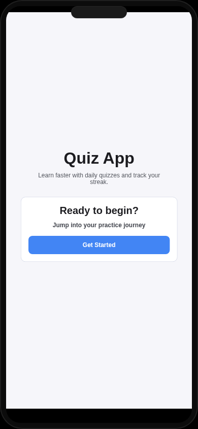
  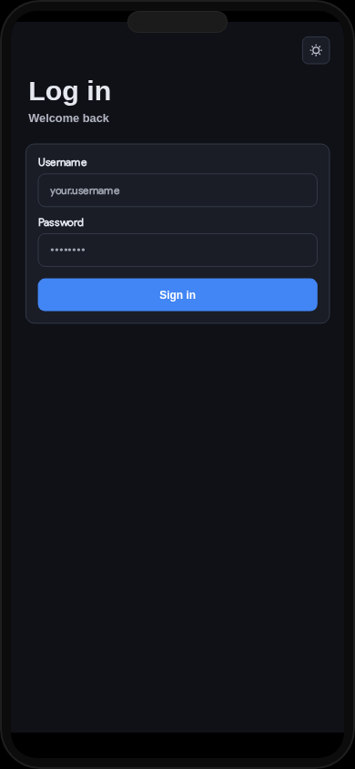
</p>

## 5.2 Main Tab Screens

### 5.2.1 Home Screen (`(tabs)/home.tsx` -> `HomeScreen.tsx`)

Route and screen:

- `phone-app/app/(main)/(tabs)/home.tsx` -> `HomeScreen.tsx`

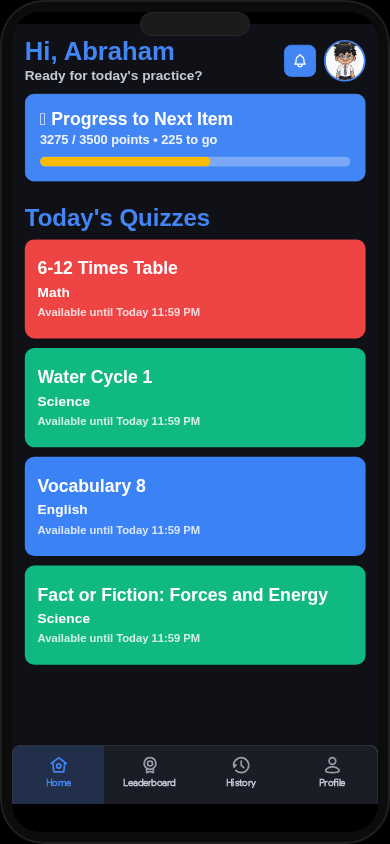

`HomeScreen` main implementation:

- Data orchestration
  - Uses `useFocusEffect` to reload whenever the tab regains focus. Swapping between Other screens and coming back to home will trigger a reload to keep content fresh.
  - Main fetch on this page runs `Promise.all([getAttemptables(token), getMyProfile(token)])`:
    - `getAttemptables` -> **[Class Service]** retrieves attemptable schedules/quiz cards for the current student.
    - `getMyProfile` -> **[Class Service]** retrieves student-class profile data (class ID, display profile).
  - After `getMyProfile(...)` returns with class data the page loads:
    - `getClassStudentGameProfile` -> **[Game Service]** retrieves rank, score, streak, and progression stats.
    - `getStudentNotifications` -> **[Game Service]** retrieves unread notification count for badge/reward/inbox signals.
- Refresh and error behavior
  - Uses the same baseline fetch sequence for pull-to-refresh (`onRefresh`) to keep behavior consistent.
  - Failures in **[Class Service]** calls (`getAttemptables`, `getMyProfile`) are treated as primary failures and page does not render and shows an error.
  - Failures in **[Game Service]** calls (`getClassStudentGameProfile`, `getStudentNotifications`) renders page with fallbacks (such as empty progress and no profile photos)
- UI composition
  - Shows attemptable quiz cards via `QuizCard` with navigation into attempt runtime.
  - Uses `useAnimatedProgress` and `useEntranceAnimation` for score progression interface.

### 5.2.2 Leaderboard Screen (`(tabs)/leaderboard.tsx` -> `LeaderboardScreen.tsx`)

Route and screen:

- `phone-app/app/(main)/(tabs)/leaderboard.tsx` -> `LeaderboardScreen.tsx`

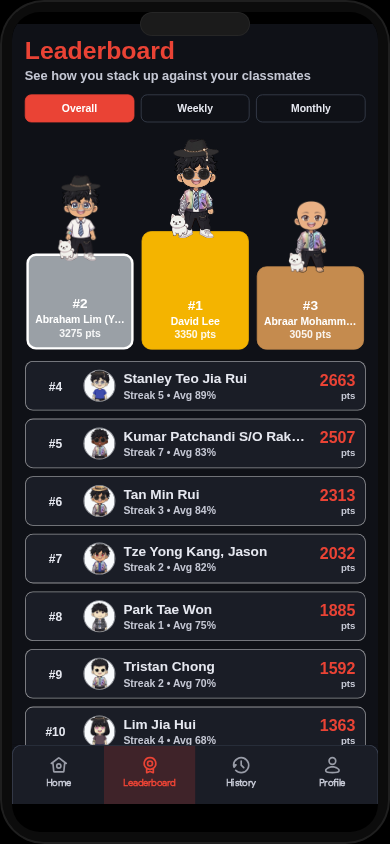

`LeaderboardScreen` main implementation:

- Data loading and period switching
  - Period tabs (`overall|week|month`) use `useFocusEffect + load` so leaderboards are only rendered on selection.
  - Loads profile first:
    - `getMyProfile` -> **[Class Service]** retrieves class context required to scope leaderboard query.
  - Then queries leaderboard:
    - `getClassLeaderboard` -> **[Game Service]** retrieves ranked leaderboard rows for the selected period.
- Ranking normalization
  - Applies deterministic client sort (`rank`, then `overallScore`, then `userId`) to stabilize ties and ordering jitter.
  - Splits top 3 into a dedicated podium layout and renders remaining rows separately.
- Linkages to other pages.
  - Tapping on any row or podium routes to student profile page with using params stored within the row/podium component. Downstream profile page uses the params to load the student profile.

### 5.2.3 History Screen (`(tabs)/history.tsx` -> `HistoryScreen.tsx`)

Route and screen:

- `phone-app/app/(main)/(tabs)/history.tsx` -> `HistoryScreen.tsx`

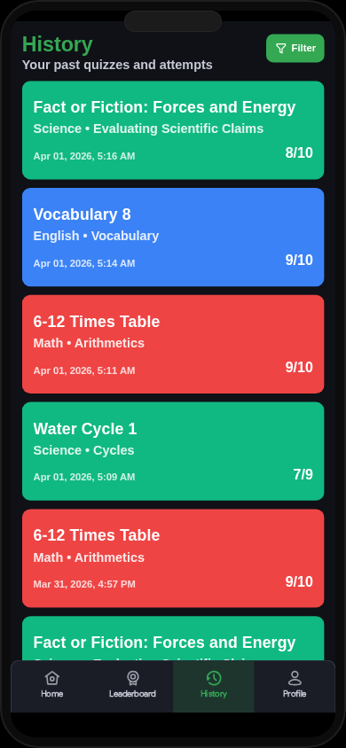

`HistoryScreen` main implementation:

- Query and filter model
  - Uses `getMyScheduleSummary(token, filters)` for retreiving all historical attempts.:
    - `getMyScheduleSummary` -> **[Class Service]** retrieves student schedule summaries with latest attempts, score, and schedule metadata.
  - Maintains local filters (`draftName`, `draftSubject`, `draftTopic`, `draftFrom`, `draftTo`) that are applied to the fetch as queries on submit
- Date filter behavior
  - Uses `@react-native-community/datetimepicker` for date selection UI.
- List rendering and navigation
  - Page sorts queried attempts by latest attempt timestamp descending.
  - Each `AttemptCard` preserves attempt identity fields (`attemptId`, `scheduleId`, quiz type), passed as params into the attempt review pages for those pages to fetch the correct attempt for display.

### 5.2.4 Settings Screen (`(tabs)/settings.tsx` -> `SettingsScreen.tsx`)

Route and screen:

- `phone-app/app/(main)/(tabs)/settings.tsx` -> `SettingsScreen.tsx`


`SettingsScreen` main implementation:

- Theme and preferences
  - Reads `scheme` from `useTheme()` and toggles through `setScheme(next)` to switch between light/dark mode.
- Account actions
  - Routes to password update page using `/(main)/change-password`

## 5.3 Main Screen Component Trees

```plantuml
@startwbs
* Phone App Shell
** Root Layout
*** ThemeProvider
*** Session bootstrap
** Unauthenticated Routes
*** LandingScreen
*** LoginScreen
*** ChangePasswordScreen
** Main Tab Routes
*** HomeScreen
*** LeaderboardScreen
*** HistoryScreen
*** ProfileScreen
*** SettingsScreen
@endwbs
```

## 5.4 Quiz Runtime Screens and Attempt Flows

These screens are mounted outside tabs and are only entered through attemptables/history routes.

Shared runtime route:

- `phone-app/app/(main)/quiz/[scheduleId].tsx` -> `AttemptScreenCoordinator.tsx`

### 5.4.1 End-to-End Attempt Orchestration

- `AttemptScreenCoordinator.tsx`
  - Main Orchestrator that resolves attempt context and chooses play vs results surfaces.
- `QuizPlayCoordinator.tsx`
  - Quiz-type dispatcher that routes to `Basic`, `Rapid`, or `Crossword` play components.
- Play screens (`QuizPlay*Screen.tsx`)
  - Own answer interaction state, timer rendering, and save/finalize trigger points.
- `QuizResultsScreen.tsx`
  - Owns post-finalize review shell and delegates detail rendering to type-specific viewers.

```plantuml
@startuml
title Full Quiz Attempt Workflow (Phone) - High-Level
!theme plain
skinparam backgroundColor #FFFFFF
skinparam defaultFontName Cabin
skinparam shadowing false
skinparam roundCorner 10
skinparam sequenceMessageAlign center
skinparam ArrowColor #3F4C5A
skinparam SequenceLifeLineBorderColor #7D8B99
skinparam SequenceLifeLineBackgroundColor #F6F8FB
skinparam ParticipantBorderColor #5D6D7E
skinparam ParticipantBackgroundColor #EAF1FB
skinparam wrapWidth 120
skinparam maxMessageSize 70
skinparam ParticipantPadding 8
skinparam BoxPadding 6
skinparam Padding 4
skinparam ResponseMessageBelowArrow true
hide footbox

actor Student #FFF4CC
participant "Phone app\nattempt screen" as App #FFE1EF
participant "Quiz svc\nattempt controller" as Quiz #DDF7E5
participant "User svc\n/auth/me" as User #DCEBFF
participant "Class svc\nattempt helper" as Class #FFE9D6
database "attempts\nDB" as AttemptDB #DDF7E5
database "quiz\noutbox" as Outbox #DDF7E5
participant "class/game\nworkers" as Proj #FFE9D6

Student -> App: Open attemptable schedule
ref over App, Quiz, User, Class, AttemptDB
Resolve attempt spec\nand resume state
end ref

Student -> App: Answer questions
ref over App, Quiz, AttemptDB
Persist incremental\nattempt progress
end ref

Student -> App: Submit attempt
ref over App, Quiz, AttemptDB, Outbox, Proj
Finalize, grade,\nand emit events
end ref

ref over App, Quiz
Load history +\nreview payload
end ref

App -> Student: Render review/history screens
@enduml
```

```plantuml
@startuml
title Resolve Attempt Spec and Resume State
!theme plain
skinparam backgroundColor #FFFFFF
skinparam defaultFontName Cabin
skinparam shadowing false
skinparam roundCorner 10
skinparam sequenceMessageAlign center
skinparam ArrowColor #3F4C5A
skinparam SequenceLifeLineBorderColor #7D8B99
skinparam SequenceLifeLineBackgroundColor #F6F8FB
skinparam ParticipantBorderColor #5D6D7E
skinparam ParticipantBackgroundColor #EAF1FB
skinparam wrapWidth 160
skinparam maxMessageSize 90
skinparam ParticipantPadding 8
skinparam BoxPadding 6
skinparam Padding 4
skinparam ResponseMessageBelowArrow true
hide footbox

actor Student #FFF4CC
participant "Phone App\n(Attempt Screen)" as App #FFE1EF
participant "Quiz Service\n(Attempt Controller)" as Quiz #DDF7E5
participant "User Service\n/auth/me" as User #DCEBFF
participant "Class Service\n/helper/attempt-eligibility" as Class #FFE9D6
database "QuizAttemptModel" as AttemptDB #DDF7E5

Student -> App: Open attemptable schedule
App -> Quiz: POST /attempt/spec (scheduleId)
Quiz -> User: Verify bearer token
User -> Quiz: Token valid + student identity
Quiz -> Class: Check attempt eligibility
Class -> Quiz: Eligibility + schedule context
Quiz -> AttemptDB: Resolve in-progress attempt if any
Quiz -> App: attemptId + renderSpec + resume state
@enduml
```

```plantuml
@startuml
title Persist Progress and Finalize Attempt
!theme plain
skinparam backgroundColor #FFFFFF
skinparam defaultFontName Cabin
skinparam shadowing false
skinparam roundCorner 10
skinparam sequenceMessageAlign center
skinparam ArrowColor #3F4C5A
skinparam SequenceLifeLineBorderColor #7D8B99
skinparam SequenceLifeLineBackgroundColor #F6F8FB
skinparam ParticipantBorderColor #5D6D7E
skinparam ParticipantBackgroundColor #EAF1FB
skinparam wrapWidth 160
skinparam maxMessageSize 90
skinparam ParticipantPadding 8
skinparam BoxPadding 6
skinparam Padding 4
skinparam ResponseMessageBelowArrow true
hide footbox

actor Student #FFF4CC
participant "Phone App\n(Attempt Screen)" as App #FFE1EF
participant "Quiz Service\n(Attempt Controller)" as Quiz #DDF7E5
database "QuizAttemptModel" as AttemptDB #DDF7E5
database "Quiz Outbox" as Outbox #DDF7E5
participant "Class/Game\nWorkers" as Proj #FFE9D6

Student -> App: Answer questions
App -> Quiz: PATCH /attempt/:id (save)
Quiz -> AttemptDB: Persist answer snapshot
Quiz -> App: Saved

Student -> App: Submit attempt
App -> Quiz: POST /attempt/:id/finalize
Quiz -> Quiz: Grade answers
Quiz -> AttemptDB: Persist final score + breakdown
Quiz -> Outbox: Enqueue AttemptFinalized
Outbox -> Proj: Publish quiz.attempt.v1
Proj -> Proj: Update analytics + leaderboard projections
Quiz -> App: Finalized result payload
@enduml
```

```plantuml
@startuml
title Load History and Review Payload
!theme plain
skinparam backgroundColor #FFFFFF
skinparam defaultFontName Cabin
skinparam shadowing false
skinparam roundCorner 10
skinparam sequenceMessageAlign center
skinparam ArrowColor #3F4C5A
skinparam SequenceLifeLineBorderColor #7D8B99
skinparam SequenceLifeLineBackgroundColor #F6F8FB
skinparam ParticipantBorderColor #5D6D7E
skinparam ParticipantBackgroundColor #EAF1FB
skinparam wrapWidth 160
skinparam maxMessageSize 90
skinparam ParticipantPadding 8
skinparam BoxPadding 6
skinparam Padding 4
skinparam ResponseMessageBelowArrow true
hide footbox

actor Student #FFF4CC
participant "Phone App\n(History/Review)" as App #FFE1EF
participant "Quiz Service\n(Attempt Query)" as Quiz #DDF7E5

App -> Quiz: GET /attempt/history
Quiz -> App: Attempt list + review payload
App -> Student: Render review/history screens
@enduml
```

### 5.4.2 Quiz Start Screens

Shared start route:

- `phone-app/app/(main)/quiz/start` -> `QuizStartScreen.tsx`
- `QuizStartScreen` fetches attempt spec from **[Quiz Service]** using `getAttemptSpec(scheduleId)`, then starts/resumes with `startAttempt(scheduleId)`.
- On success, it caches `{ spec, attempt }` and routes to the play coordinator screen.

<div style="display: grid; grid-template-columns: repeat(3, minmax(0, 1fr)); gap: 20px; align-items: start; margin: 16px 0;">
  <figure style="margin: 0; text-align: center;">
    <strong style="display: block; margin-bottom: 10px;">Basic start:</strong>
    
  </figure>
  <figure style="margin: 0; text-align: center;">
    <strong style="display: block; margin-bottom: 10px;">Rapid start:</strong>
    
  </figure>
  <figure style="margin: 0; text-align: center;">
    <strong style="display: block; margin-bottom: 10px;">Crossword start:</strong>
    
  </figure>
</div>

### 5.4.3 Basic Quiz Attempt Screens

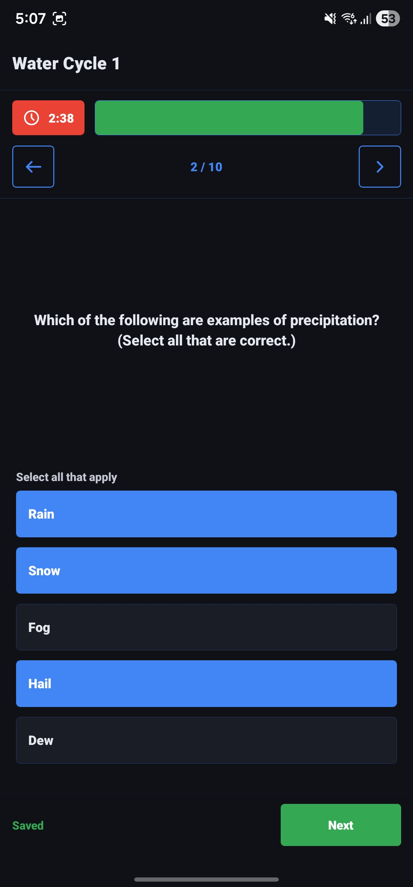
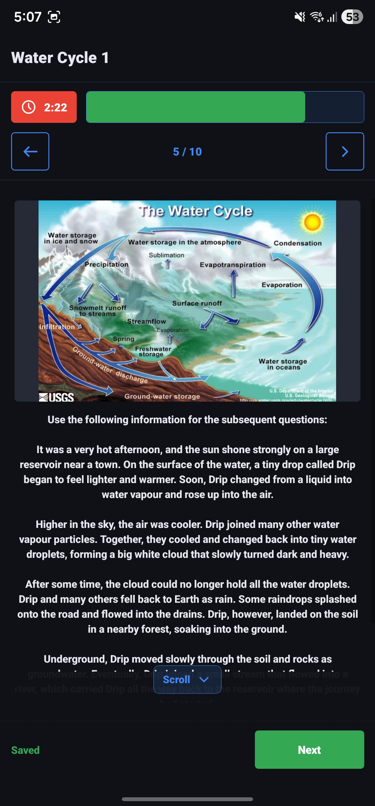
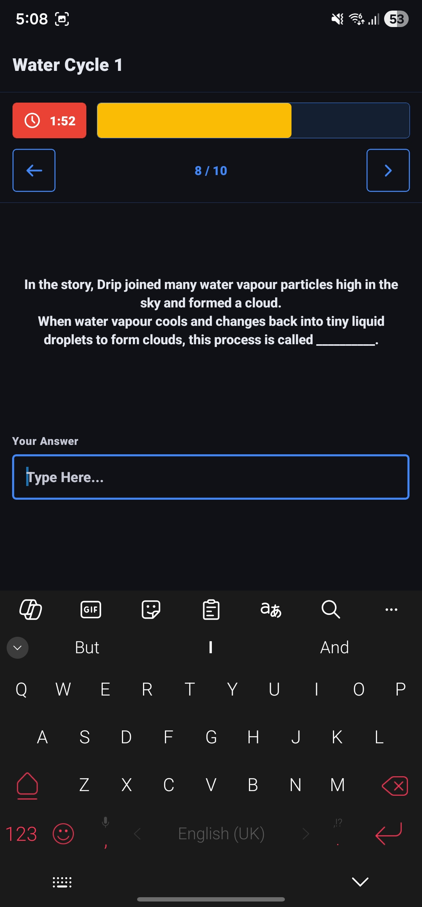

- `AttemptScreenCoordinator.tsx`
- `QuizPlayCoordinator.tsx`
- `quiz/play/QuizPlayBasicScreen.tsx`

`QuizPlayBasicScreen` implementation:

- Validation of incoming spec
  - Validates incoming `AttemptSpec` with `isBasic(spec)` and fails safely on wrong routing.
- Timer/save/finalize integration
  - Uses `useQuizTimer` for total-time countdown state.
  - Uses `useDebouncedSave` for incremental saving and `flushSaves` on step transitions (like navigating to a new question).
  - Uses `useQuizFinish` to finalize and navigate via `navigateToQuizResults`.
  - `useDebouncedSave` and `useQuizFinish` call **[Quiz Service]** endpoints:
    - Save progress (`PATCH /attempt/:id`) -> stores in-progress answers.
    - Finalize (`POST /attempt/:id/finalize`) -> grades attempt and returns result envelope.
- Answer-state management
  - Normalizes initial answers from in progress attempts (`normaliseInitialAnswers`).

### 5.4.4 Rapid Quiz Attempt Screens

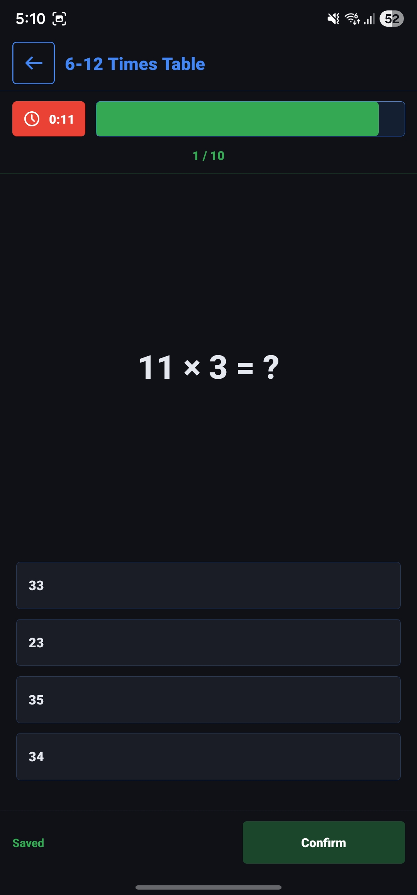
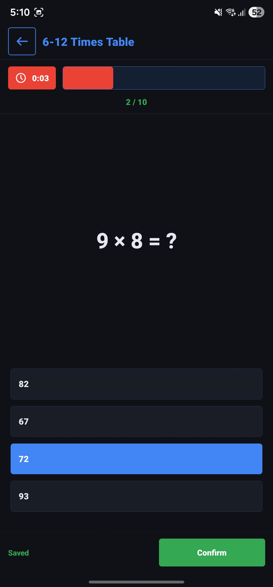
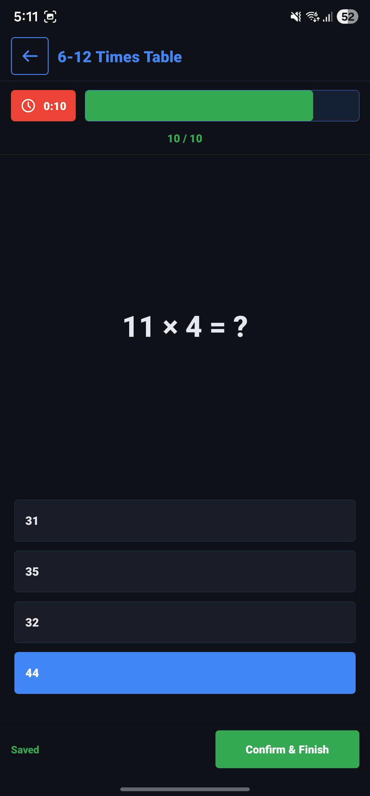

- `AttemptScreenCoordinator.tsx`
- `QuizPlayCoordinator.tsx`
- `quiz/play/QuizPlayRapidScreen.tsx`

`QuizPlayRapidScreen` implementation:

- Calculates position based on elapsed time
  - Rapid quiz has per-question time limits rather than overall timer. System needs to take the time elasped, the timer allocated to each question to determine which question the student should be on and how much time is left for that question.
  - It is possible that the elapsed time would land the student back on a question that they have already attempted (due to them submitting questions early). In this case, the student is shown the last attempted question with full remaining time for that question.
- Per-question progression
  - Maintains per-question timers (`qRemaining`) and auto-advances when timer for that question is elapsed.
  - Records selected option at moment of selection then saves to the quiz service through `saveAnswers` (**[Quiz Service]** `PATCH /attempt/:id`) before moving forward.
- Finalize behavior
  - Final question submission (or timer running out) triggers `finishAttempt` (**[Quiz Service]** `POST /attempt/:id/finalize`).

### 5.4.5 Crossword Quiz Attempt Screens

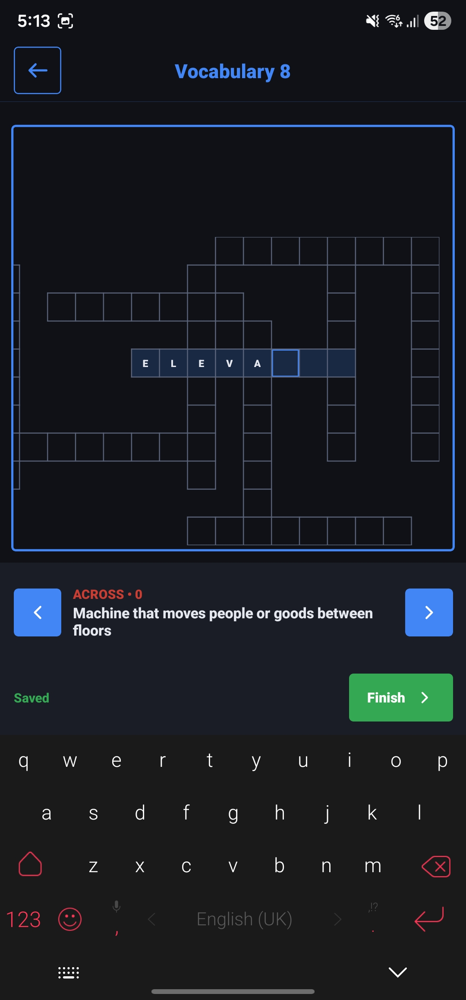
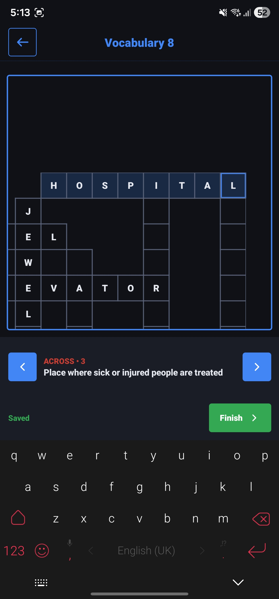
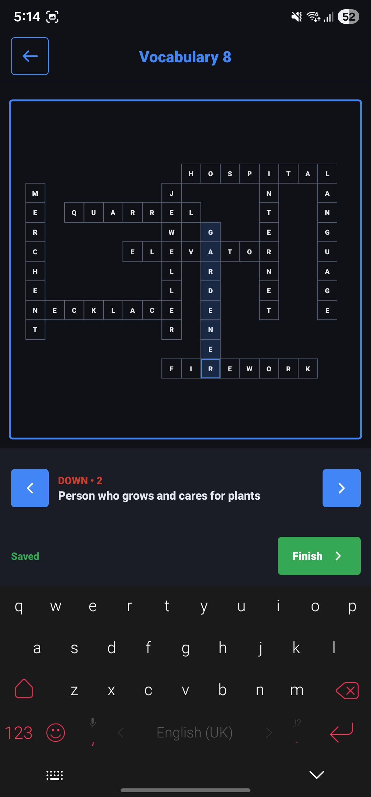

- `AttemptScreenCoordinator.tsx`
- `QuizPlayCoordinator.tsx`
- `quiz/play/QuizPlayCrosswordScreen.tsx`

`QuizPlayCrosswordScreen` implementation:

- Crossword validation and grid bootstrap
  - Validates `AttemptSpec` with `isCrossword`.
  - Builds crossword cell map from `renderSpec.items[0].grid` using `buildBlockedSet(...)`.
  - Builds a cell to word mapping every cell that contains a letter (`across`/`down`), which drives cell-to-word navigation logic.
  - Reconstructs a `gridLetters` state from in-progress attempt payload:
    - Reads `attempt.answers.crossword[entryId]` per entry.
    - Projects each character back into its `(row,col)` positions.
- Pan/zoom and grid interaction
  - Supports pinch/drag navigation with transforms. Bounded using (`MIN_SCALE`, `MAX_SCALE`, `clamp`)
  - Uses `PanResponder` + animated transform values (`scale`, `translateX`, `translateY`).
  - Initializes grid to fit in viewport via `computeInitialGridTransform(...)`
- Cell/word navigation behavior
  - Tap cell: focuses that cell and selects an entry that contains it (prefers current direction when possible).
  - Highlighting: all cells in the active entry are highlighted, with stronger highlight for the selected cell.
  - Type character: writes into selected cell, then advances to the next cell in the active entry.
  - Delete/backspace: clears current cell; if already empty, moves to previous cell in the same active entry.
  - Intersection toggle: when a cell belongs to both across and down entries, repeated tap toggles active direction/entry.
  - Clue selector: selecting a clue directly swaps active entry and moves selected cell to that clue’s current/first position.
- Save/finalize flow
  - Derives crossword answers from user entered letters in grid. Saved into strings for each entry.
  - On every letter change, system saves attempt progress to backend using `useDebouncedSave`.
  - Finalizes attempt when user taps Finish, or when timer runs out
  - Save/finalize calls go to **[Quiz Service]**:
    - Save progress (`PATCH /attempt/:id`) for crossword answer snapshots.
    - Finalize (`POST /attempt/:id/finalize`) for grading and attempt closure.

## 5.5 Post Quiz and Review Screens

Post-quiz outcome and detailed review are separate stages in the mobile flow.

Post-quiz route:

- `phone-app/app/(main)/quiz/results/index.tsx` -> `QuizResultsScreen.tsx`

Review route:

- `phone-app/app/(main)/attempt/index.tsx` -> `AttemptScreenCoordinator.tsx` + typed viewers in `AttemptBody.tsx`

### 5.5.1 Post Quiz Screens


`QuizResultsScreen.tsx` post-quiz implementation:

- Entry into post flow
  - Play screens call `navigateToQuizResults(...)` after finalize and route into `/(main)/quiz/results`.
  - Route params carry quiz attempt context (`attemptId`, `classId`, `scheduleId`, score snapshot, quiz name, and answer-availability flag).
- Outcome polling and synchronization
  - Calls `getStudentAttemptOutcome` -> **[Game Service]** to post-attempt game progression state (incluing rewards/rank changes) using `attemptId` as the key.
  - Polls every `OUTCOME_POLL_MS` (700 ms) until `ready=true`, with a hard timeout (`OUTCOME_TIMEOUT_MS` = 15 seconds).
  - If timeout is hit, screen switches to fallback error screen that allows user to proceed to review but does not show rewards or rank changes.
- Reward acknowledgement lifecycle
  - Once outcome is ready, calls `acknowledgeAttemptRewards` -> **[Game Service]** exactly once per attempt context.
- Three-step post screen model (Separate From Review)
  - Step 1 ("Your Quiz Outcome"): Attempt score, overall point changes, threshold progress (toward next item), and rank changes.
  - Step 2 ("Rewards Unlocked"): List of rewards awarded with cosmetic/badge previews and links to a reward detail page.
  - Step 3 ("Next Action"): Controls for continuing app flow (to home or detailed answer review).
  - The screen uses a horizontal pager with dot indicators and controlled step transitions (`step: 0 | 1 | 2`), so post-attempt feedback is presented before review.
- Separation from review pipeline

### 5.5.2 Basic Quiz Review Screens

Review rendering is type-specific and selected by `AttemptBody.tsx` (inside `AttemptScreenCoordinator.tsx`) based on quiz type.

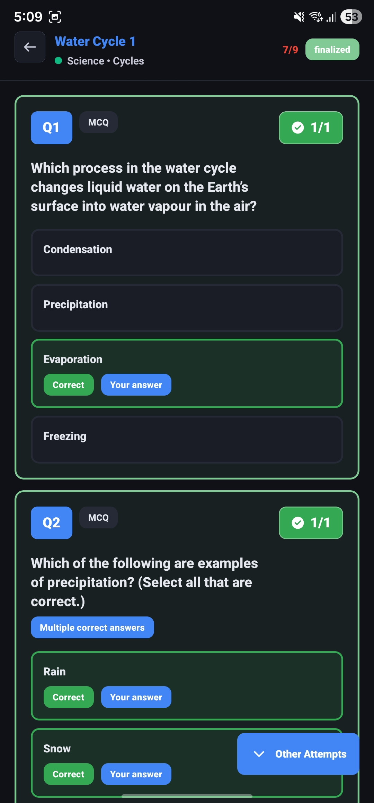
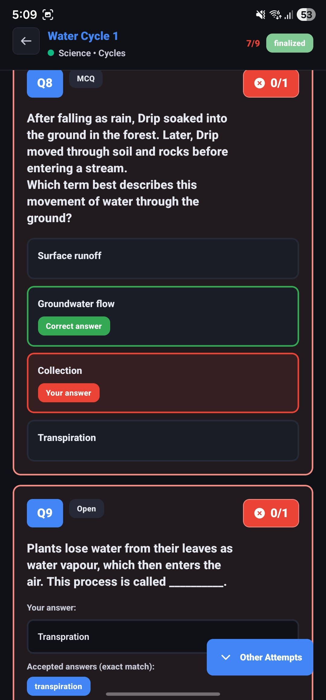

- `quiz/attempts/BasicAttemptViewer.tsx`

`BasicAttemptViewer` main implementation:

- Review data normalization
  - Reads snapshot spec from `quizVersionSnapshot.renderSpec` which includes items and their answers.
  - Reads `doc.answers` for the student’s submitted answers, and reads breakdown by `itemId` to map awarded scores and selected vs correct options.
- Grading visualization
  - Applies styling (`success`, `error`, neutral) based on awarded/max or correctness of question
- Option/result rendering
  - Renders each option using `OptionRow` with selected/correct badges.
  - Shows awarded points using `AwardPill`.
  - Includes image prompts and multi-select labels for questions that require it.

### 5.5.3 Rapid Quiz Review Screens

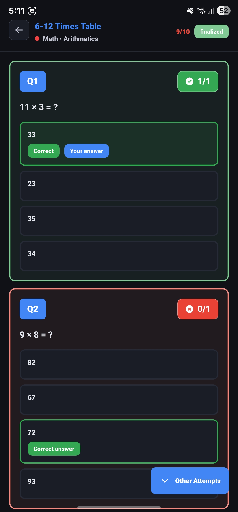
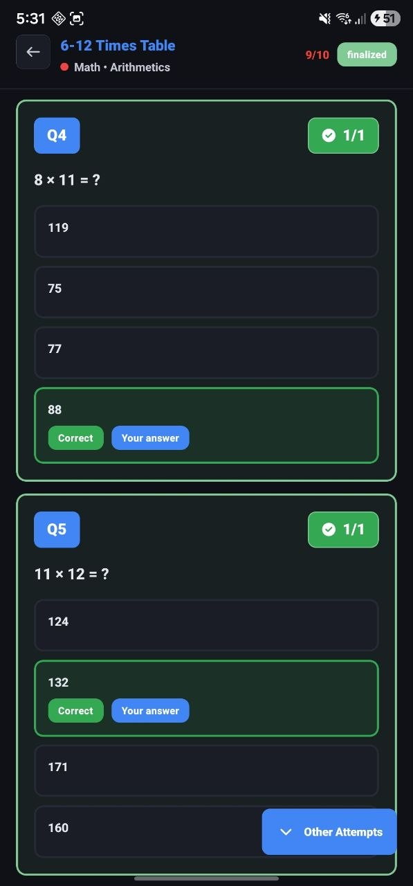
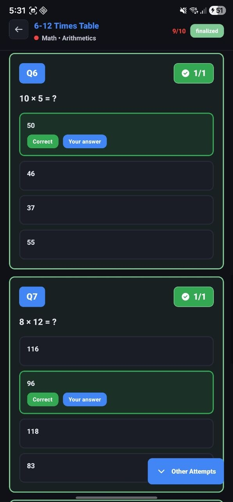

`RapidAttemptViewer` main implementation:

- Review data normalization (Similar to BasicAttemptViewer)
  - Reads snapshot spec from `quizVersionSnapshot.renderSpec` which includes the rapid quiz items.
  - Reads `doc.answers` for the student’s submitted answers, and reads breakdown by `itemId` to map awarded scores and selected vs correct options.
- Grading visualization
  - Applies styling (`success`, `error`, neutral) based on awarded/max or correctness of question.
- Option/result rendering
  - Renders each option using `OptionRow` with selected/correct badges.
  - Shows awarded points using `AwardPill`.
  - Includes image prompts for questions that require it, and fallback messaging when answers are not yet available.

### 5.5.4 Crossword Quiz Review Screens

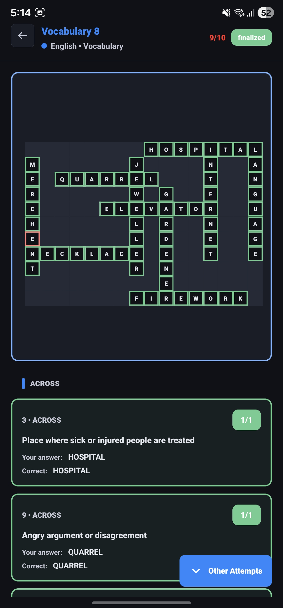
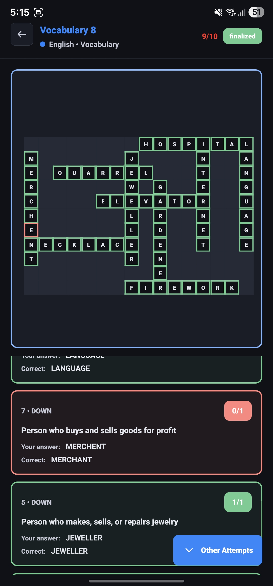

`CrosswordAttemptViewer` main implementation:

- Reconstructs crossword grid letters from saved attempt answers and letter positions from attempt spec.
- Checks for correctness in each individual cell using `breakdown.meta.expected` versus user inputs under `doc.answers`
- Supports pan/zoom navigation with the same grid transform logic as the play screen.
- Cells in the crossword grid are styled with error/success colours based on whether the letter matches that cell. Grades are still by word matching, and are reflected in the list of words below the grid, also styled by correctness.

## 5.6 Profile, Avatar, and Badge Screens

### 5.6.1 Profile Screen

Route and screen:

- `(tabs)/profile.tsx` -> `ProfileScreen.tsx`

`ProfileScreen` main implementation:

- Data loading
  - Fetches class profile (`getMyProfile` -> **[Class Service]**) and game profile (`getClassStudentGameProfile` -> **[Game Service]**) on focus.
- Composition
  - `StudentProfilePage` contains student profile structure. ProfileScreen passes data props (rank, score, streaks, participation, average score).

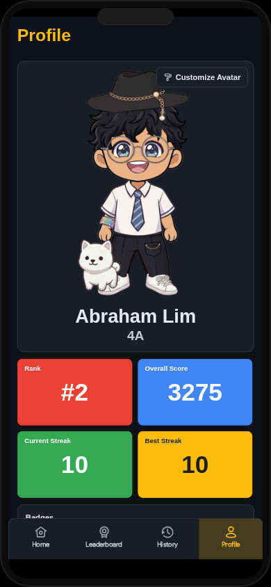

### 5.6.2 Avatar Customization Screen

Route and screen:

- `app/(main)/avatar-customize.tsx` -> `AvatarCustomizeScreen.tsx`

`AvatarCustomizeScreen` implementation:

- Catalog + inventory
  - Retrieves user class data via `getMyProfile` -> **[Class Service]**.
  - Then with class and user data, loads:
    - `getRewardsCatalog` -> **[Game Service]** retrieves cosmetic catalog.
    - `getStudentInventory` -> **[Game Service]** retrieves owned cosmetics and currently equipped items.
  - Tracks selected avatar slot and derives owned/equipped cosmetics per slot.
- Equip item flow
  - Applies slot changes through:
    - `equipStudentItem` -> **[Game Service]** equip specific cosmetic in slot.
    - `setStudentEquippedSlot` -> **[Game Service]** clear slot (if allowed) or set direct slot state.
  - Guards compulsory slots from being unequipped.

User-facing cosmetic slots currently include:

1. Skin colour
2. Hair
3. Eyes
4. Mouth
5. Upperwear
6. Lowerwear
7. Outerwear
8. Shoes
9. Wrist accessory
10. Head accessory
11. Eye accessory
12. Pet

Skin tones are available from the start rather than being locked behind rewards. There are also a good amount of basic hair, eye and mouth options available from the start, while the main earnable customisation items are clothing and accessories.

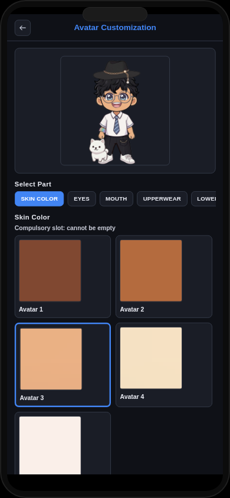

### 5.6.3 Badge Inventory Screen

Route and screen:

- `app/(main)/badge-inventory.tsx` -> `BadgeInventoryScreen.tsx`

`BadgeInventoryScreen` implementation:

- Inventory loading
  - Retrieves user class data via (`getMyProfile` -> **[Class Service]**), then fetches owned/displayed badge state through `getStudentBadges` -> **[Game Service]**.
- Displayed badges updating
  - Uses `updateStudentDisplayedBadges` -> **[Game Service]** as the single write path for display badge IDs.
  - Handles capacity constraints (max displayed badges) with replacement modal when attempting to display more than max allowed badges.

The badge inventory surfaces rule-based achievement badges that are assembled from reusable base assets and layered visual elements rather than separate hand-drawn images for every badge. Current badge meanings include score thresholds, streak thresholds, weekly top placements, and monthly top placements.

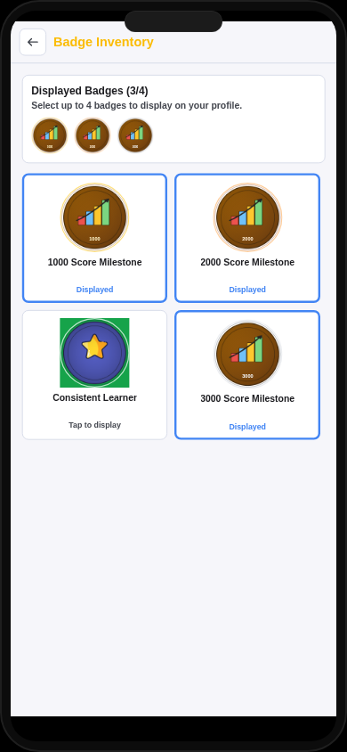

## 5.7 Phone Component Trees

```plantuml
@startwbs
* Phone Runtime Topology
** Root shell
*** ThemeProvider
*** Session store
** Tab shell
*** HomeScreen
*** LeaderboardScreen
*** HistoryScreen
*** ProfileScreen
*** SettingsScreen
** Secondary routes
*** AvatarCustomizeScreen
*** BadgeInventoryScreen
*** NotificationsScreen
@endwbs
```

```plantuml
@startwbs
* Phone Quiz Runtime
** AttemptScreenCoordinator
*** QuizStartScreen
*** QuizPlayCoordinator
**** QuizPlayBasicScreen
**** QuizPlayRapidScreen
**** QuizPlayCrosswordScreen
*** QuizResultsScreen
**** BasicAttemptViewer
**** RapidAttemptViewer
**** CrosswordAttemptViewer
@endwbs
```
